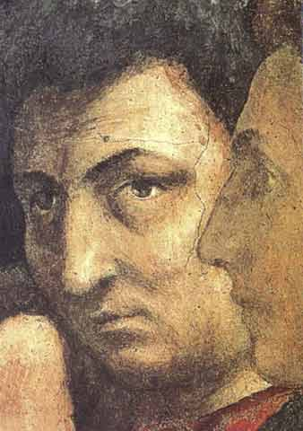
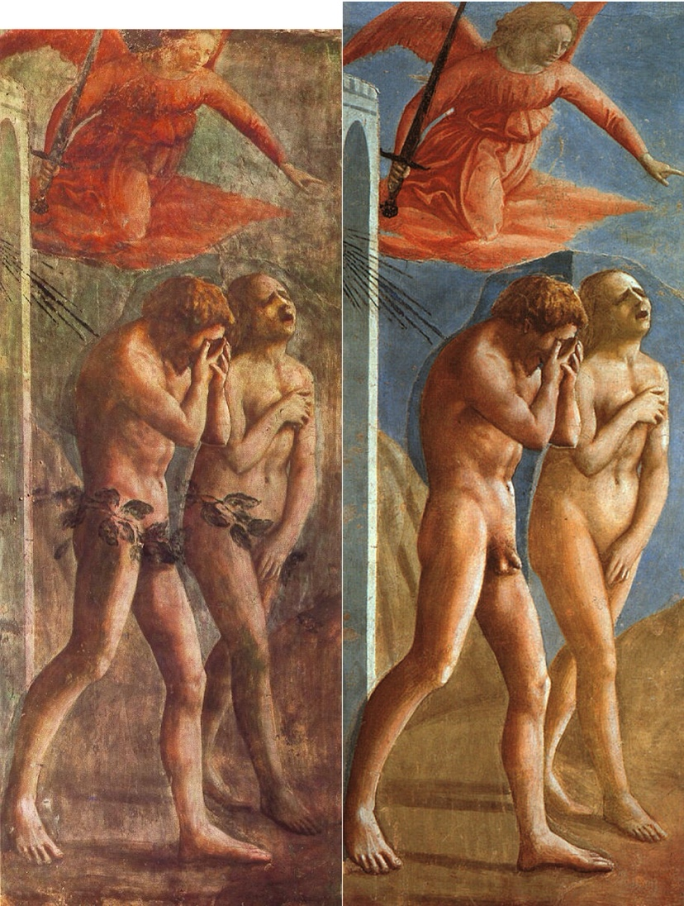

# 文艺复兴

融会贯通

佛罗伦萨画派 Florence 
对古代文化价值的巨大承认
Toscan

Leo XI - Medicci @ Vatican
药丸子——美第奇家族族徽

古代最高的拱顶 红屋顶

## Florence的钟楼

1334年-
乔托 （旧时代最后与新时代最新的画家）

达芬奇睡眠法！那个时代的Polymath

> “Renaissance man" today, it is meant that, rather than simply having broad interests or superficial knowledge in several fields, the individual possesses a more profound knowledge and a proficiency, or even an expertise, in at least some of those fields.

## Florence Cathedal

大穹顶 Dome of Santa Maria del Fiore
建筑师 Brunelleschi
118米高！
Defy the law of gods‘ gravity law

智慧以及创造力

**教堂外雕塑**
并不反对古典文学艺术学术名人进入宗教建筑雕塑，现实生活场景也包含进去

- Phidias 雕像
- Apelles 
- 上帝创造亚当
- Plato and Aristotle
- 建筑师
- 药师

远比中世纪雕塑更现实主义。
**天顶画**
vasali的天顶画

## Vasari Corridor

现在变成了一个长廊

# Renaissance

布克哈特 
古代的复兴～与意大利天才的结合
征服西方世界的成就

**人文主义者**

- 观点的多样性
- 以人为中心
- 自我意识觉醒——表现艺术家本人
- 质疑沉思默想 敬奉上帝的生活，世俗的生活方式也被弘扬

特别的

一代一代的老师，学生 画风愈发真实 如图片一般

## Giotto

使人物处于完整的空间中

Giotto 画Crucifix
还原成真实的人，有重量有痛苦的人

接受圣痕的人

### 39幅教堂湿壁画

1305-1306年 
丈夫扛着 妻子向天堂献模型

Betroth of Virgin

Joachiam与Anne 金门相会
有胡须的基督 vs 没胡须的基督

## 马萨乔Masaccio

可以看到自然背景，人物在地面的阴影

## Donatello

新时代的第一位雕塑家
圣马可
大卫

从不裸体到裸体 是中世纪到文艺复兴

卫队长的骑马像

## Botticelli

忧郁 柔美的风格
画面中 看着画面外的人 一般都是身份特殊的
唯美主义

《春》 维纳斯的诞生
画的希腊罗马神话故事！
——love is blind
带有一点忧伤的美是最美的

对女性美的表现特别强烈
——现实中有吗

晚期毁了很多画 

Gelato 