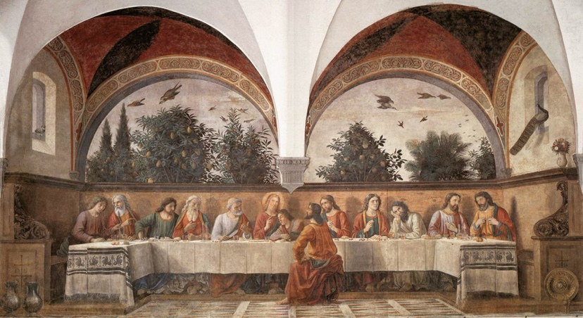
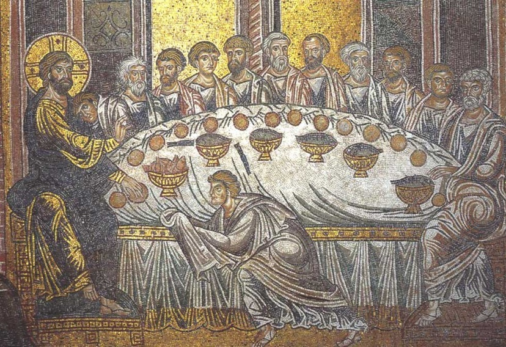
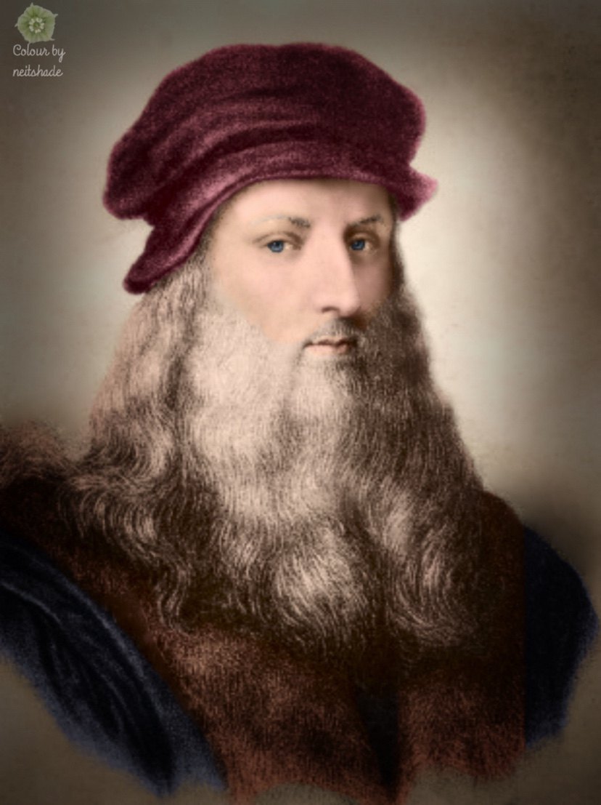

## Da Vinci

## 最后的晚餐

戏剧性场面
约翰 有点女性化
——有人以为是耶稣的秘密妻子 ——丹 布朗

年纪最小 金发 没有胡须
自然光为耶稣带上光环

约翰一直在画中跟耶稣就很亲密……金发美男子

桌子上的的🐟？

- Davinci喜欢 鳗鱼段配橘子
- 最后的晚餐 通常画面包，为啥他画🐟
- 鱼是有基督教象征的——天国是捕捉鱼的网
- 早期也是吃鱼
- 希腊语鱼Ichthus 跟Jesus发音很像，都是 可能早期基督教的暗语

- Pinxit mea 
- 所画即我
  

## Mona Lisa

- 主人：丝绸商人的妻子
- 住Da Vinci他父亲家旁边
- Da Vinci晚年去了法国 跟法国国王一直关系很铁
- 奇怪之处
  - Mona Lisa一直带着这幅画在身边，如果是委托画 为何不交接就很奇怪
  - 背后的风景 右高左低
  - 没有眉毛…好像当时时尚就是女性剃掉眉毛？
  - 2012年西班牙找到一副有点脏的Mona Lisa 发现是有眉毛的
  - 她当时似乎是怀孕的

Mona Lisa当初失而复得过一次，然后暴得大名，法国都知道了

Mona Lisa对面是 威尼斯画派的最后一位 的大幅画 没人看

肖像画的画法很不一样  
Mona Lisa画出了背景全部的背景

Biology of Seeing：在画的左边 余光来看 笑容特别灿烂～正脸看反而有点忧郁

有人觉得 Mona Lisa的画像有几层跟Salai很像

### 弗洛伦萨妇女

### 画的政治含义

**去往美国**
肯尼迪夫人——杰奎琳 特别崇拜法国 
后来卢浮宫 去美国国家美术馆 
法国文化部部长
画展开幕词

**去日本**
Mona Lisa去日本
田中角荣年代

**去莫斯科**

## 米开朗基罗

古风雕塑

* 少年时代 观赏过大量古代雕塑(罗马石棺 Sarcophagus )
  * 石棺上十分复杂的人体结构群
* 人体结构的理解
  * 自身解剖过人体, 有基础, 理解十分深刻

### 圣伤Pieta(哀悼基督)

* 年轻的圣母 像少女一般 (当时其实50岁了! )
* 女性的怀抱和成年男人的人体 内在矛盾! 
  * 基督的身体沉重但放在圣母怀抱里 通常显得很不合适
  * 如果让多个人来支撑 削弱了母子之间感情的强大感染力
  * 画成瘦弱的僵尸也不好, 不自然
* 用圣母的身体做一种支撑!! 
* 1330 14世纪的Pieta
* 八卦
  * 圣母绶带上的签名~ Michaelangelo
  * 影响后面诸多艺术家在绶带上签名
  * 唯一有自己签名的作品

### David

当时刚刚能采集到5米高 的大理石

* 从神话中的少年 成为了成年人, 
  * 并因为放在Florence一个共和国广场上成了共和国公民的一种理想形象
* 反S形身躯 以及 姿势
* 类比Apollo

### Moses

似乎翻译圣经翻译的错误.....以为摩西有两个角

* 两边的雕像
  * 沉思的生活
  * 积极行动寻找真理的生活
* 八卦
  * 米开朗基罗情不自禁的把榔头扔到他腿上 留个痕迹
  * "你简直是活的诶, 怎么不站起来走啊 啊! "

###  Sistine Chapel

一个不爱画画的人画了500m2的天顶

Gods create Adam

* ​
* 人的尊严得到了极大的弘扬!! ( 米开朗基罗的形象 )
* God Creates Adam and Brain~

## Raphael

绘画的巅峰

* 非常俊秀
* april 4th 出生和死亡
* 脾气也很好, 崇拜Davinci. 但Da Vinci嫉妒他

### 雅典学院 Athena Academy

* Plato画的是Da Vinci的形象!! 十分钦佩
* Raphael的面包情人
  * ​

### Saint George Struggling with the Dragon

### Raphael的情人

Raphael的签名经常自各种衣服边上

