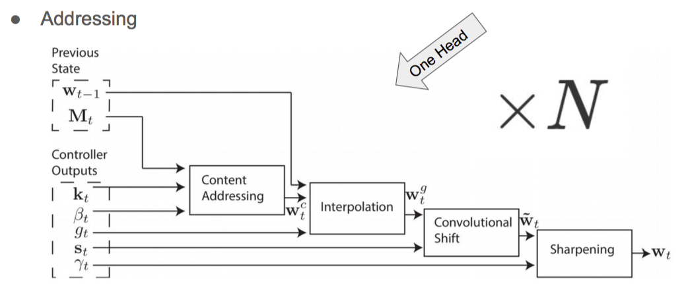

RNN 就是一个动力系统?!?!

是一个Dynamics?

# RNN

Turing Complete

Feedforward Neural Network

* Univarsal approximation theorem: 对于Bounded Continuous Function普遍近似/拟合能力

然而组合问题 优化问题?

* Sequence Modelling?
* 变化长度的输入输出?

在时间上展开RNN就是 纯函数, 最简单的模型, 很简单
$$
h_1,y_1=F(h_0,x_1,W)\\
h_2,y_2=F(h_1,x_2,W)\\
...
$$
分类?

* Language Model: 概率模型
  * Seq to Seq, 
  * 预测下一个词
* Sentiment Analysis: 理解语言的情绪
  * Seq to one (一维分类变量)
* Neural Language translation: encoder - decoder
  * Seq to one - one to Seq
  * Bottleneck结构, (Cf. Autoencoder)
  * ​

# LSTM & GRU

 **Vanishing and Exploding Gradient**

* Backpropagation through time. 去优化$W$ . 几乎必然explode或者Vanish

LSTM: 有机会去忘记前面的输入
$$
(i)
$$
LSTM ~ Weight Sharing Resnet

GRU Gated Recurrent Unit

网络结构研究者在跑一个大的遗传算法…….从LSTM和GRU开始, 做更新优化

## RNN Extension

### 2D Pixel RNN

可以做 Segmentation 

如何增加receptive field, 增加长程关联? 用Pixel RNN

# Attention

* Attention 即加权 ($\sum_ia_i x_i$)
  * 对于图片加权加在Location上
  * 对于Sequence类似Temporal加权

Predict 一个分布?

* 每次多生成一个变量$h'_i$, 
* for j $<h'_i, h_j>=w_{ij}$
* $w_{ij} $

图像Attention

Hard attention, 这个分布定variance 定尺寸

# Neural Turing Machine

关键 **External Memtory**: Learn Program from Data

* 例如 Sequence Copying

Memory是啥? 

* 其实就是一个隐变量, 每次在创立新的Memory $M_t$ 
* Read 操作~Attention很像, 
  * 就是创建一个分布对memory进行加权
  * $r_i=\sum w_t(i)M_t(i)$ 相当于Soft的读行
* Write 操作
  * $M_t(i)\leftarrow  M_{t-1}(i)[1-w_t(i)]$ 
  * $M_t(i)\leftarrow M_t(i)+a(i)w_t(i)$ 
* Addressing 如何设计? Predict Weight vector
  * 按内容查找? 作 vector similarity
  * 与上一步线性插值 每次不全变
  * 上一次的weight作 Convolution Shift, 使得读头可以移动
  * Sharpening
    * 希望更离散而非连续, 分布很尖
  * 综上有四步: 

https://en.wikipedia.org/wiki/Turing_machine

Differential Neural Computor-关键在于将Turing的Idea变成可微的了. 于是可以Gradient Descent

# Application

* 非Sequence, Attention 在变化, 读入不同的, 也可以! 
  * ​
* Recursive, 计算语言学计算Parser Tree
* 语音识别
  * 将语音处理成 Spectrogram, 用频谱图作为输入
* Question Answering, 需要存储知识 fetch知识!
* Pointer Network 输出
  * 输出选择, (机器翻译网络去掉词语输出 只保留)
  * 做三角剖分
  * TSP问题
* 搜索NN结构, Meta-learning
  * ​

Attention是某种很关键的东西.!! 

