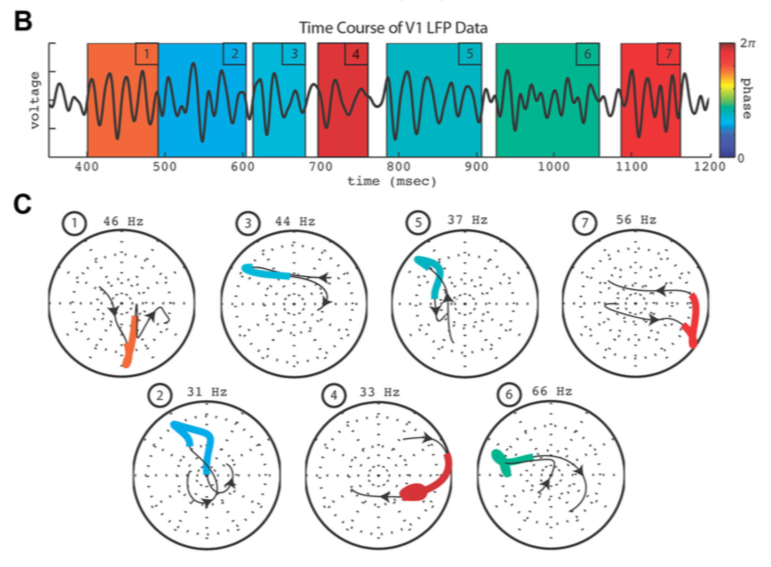

https://en.wikipedia.org/wiki/Time–frequency_analysis

所有的Spectrogram, Sonogram都可以归结于 Time-Frequency Analysis

## Short time Fourier Transform

STFT

## Continuous Gabor Transform

https://en.wikipedia.org/wiki/Gabor_transform

simple localization of the Fourier transform via the introduction of a sliding window function!!!

Transform之后depend on time and frequency.— 是一个时域频域共同表示! 
$$
G_x(t,f)=\int\exp(-(s-t)/\tau)e^{i2\pi s f}x(s)ds
$$
特别注意, CGT产生的complex series可以画成Phase portrait. 

## Wavelet Transform

