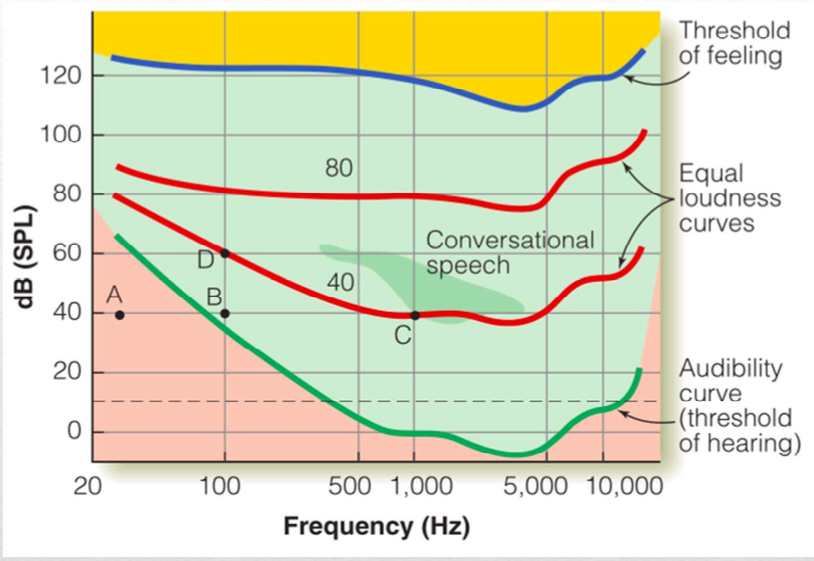

* Sound Pressure Level - Loudness 
* Frequency - Pitch
* 

## Structure of Sound

### Harmonic Structure

注意: 去除了一个Harmonics中的基频, 其整个的周期性, 依然是基频的周期性！所以听出来依然是基频所以不奇怪

【神经系统的周期性输入？

## Perception of sound

### Loudness

如何测量Loudness感知呢? 等响度线

* 

Audiblility curve: 

 

### Pitch

Frequency 的Perceptual属性

**Tone Chroma**: 听起来是同一个色调/音调的声音. 正好相差整数倍, 协音. 

**Effect of missing fundamental**: 去除一个Harmonic或者去除Fundamentals不会影响知觉

注意电话会滤波 保留 300-3400Hz的波段, 但是其基频可能低于300Hz, 也能被知觉到

### Timbre

**音色结构**: 

* 频谱结构会影响
* Time Course也会影响音色! 如上升沿下降沿的形状. 
* 钢琴的声音录音了倒着放 很类似Organ

Cf. [Neurophysiology](..\Early Auditory Processing.md)

