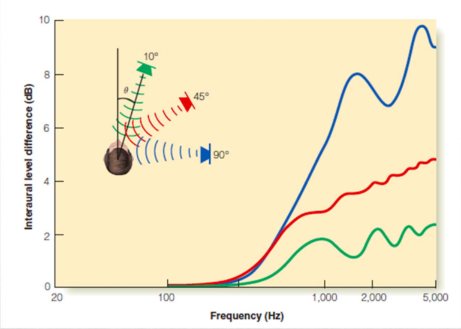
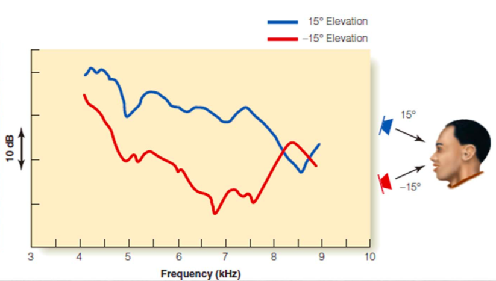
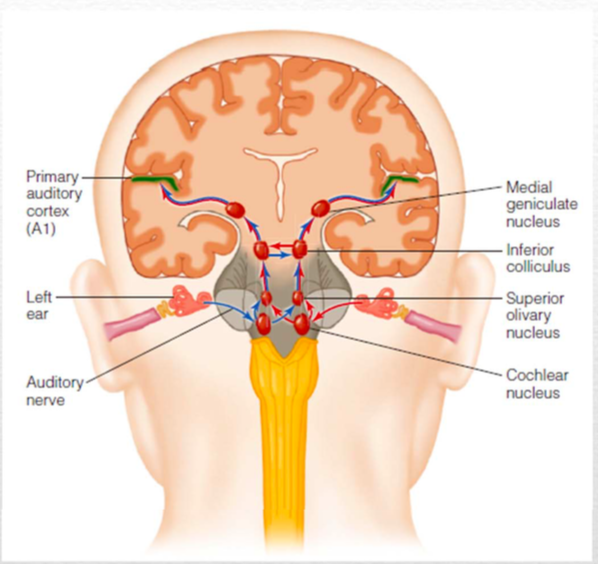
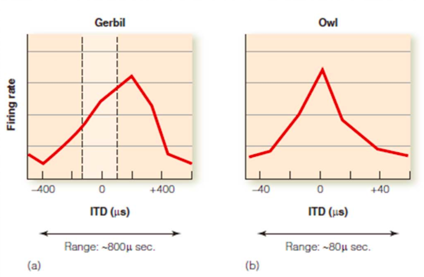
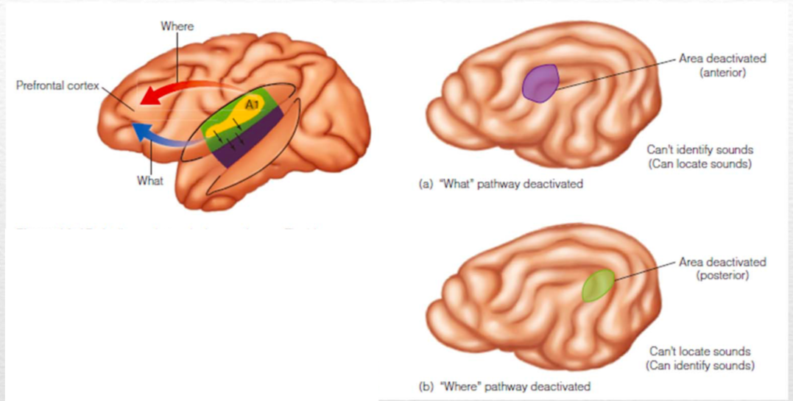
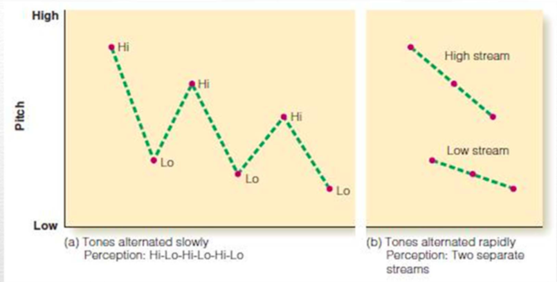
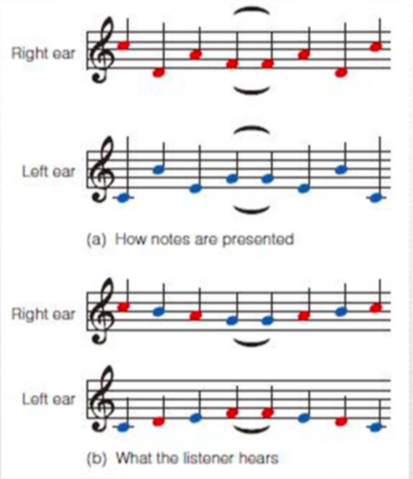
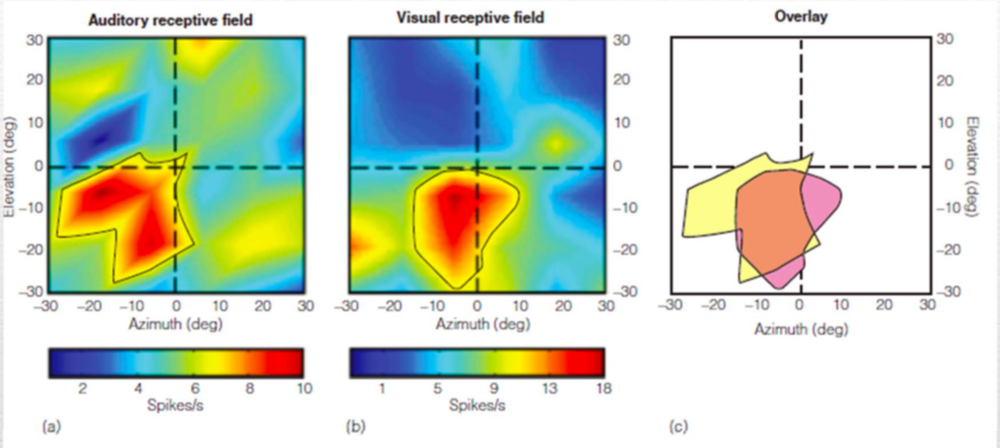

[TOC]

声音的知觉不只有其直接的物理属性，还有从中推出的知觉属性。

我们会怎么来分析一个声音呢？

**Perceptual Problems for Auditory System**

* Auditory Localization : 从声音定义其方向角，远近
* Reflected Sound：反射的声音场会扰乱定位！【澡堂、教堂、共振腔
* Auditory Scene Analysis：声音场景分析，获得数据

## Auditory Localization

**Parametrization**

* (Distance, Azimuth, Elevation)

### Cognitive Cue

For **Azimuth** we have these **Biaural** cues~ 

* Interaural level difference (ILD)
  * 所谓 Acoustic Shadow 声影区
* Interaural time difference (ITD)
  * 双耳时间差. 

注意，基于物理声学波的传播规律，两种Cue的有效程度与Frequency, Wave length of Sound 有关! 

**Cone of Confusion**

对于ILD, ITD的线索完全相同。

For **Elevation** we have the **Monaural** Cue~

**Spectral Cue**：由于在人的耳廓形状有上下方向的不对称性，上方与下方发射声音，接收到的Spectrum会很不一样。

心理物理学实验~

### Physiology Mechanism

双侧的听觉信息是何时结合的呢?

[Early Auditory Processing](../Early Auditory Processing.md)

**Jeffress Neural Coincidence Detection Model** (1948)

通过两侧神经投射的Axon Delay来测量ITD。双侧传输线上，不同位点的同时到达时间不同，可以选择出其中的一个特定的神经元。最后是用Place code编码正负时间差。

这一过程，生理上是在Superior Olivary Nucleus发生

注意到，mammal的听觉远没有猫头鹰清楚，如老鼠和猴子的Tuning Curve比Owl宽得多!! 

因此其位置编码要很准确需要Population COding/decoding，不能只是Place Code，需要有下游Sharpening的效应。

### Auditory Processing in Cortex

**Where and What Pathway**

通过Impair研究可以发现声音的定位大体在 Posterior区，而Identification大体在Anterior区。

## Auditory in the Room

在自然环境中 有各种回声、吸收，因此感知到的声音环境 以及定位不像前面的ITD, ILD那么简单呢。

**心理物理实验：源的位置判别**

使用两个声音左右刺激，一个Lead一个Lag，5-20ms中两个声音可以被知觉为一个。

Cf. Architectural Acoustics 建筑声学

* Reverberation time：混响时间 一个声音衰减的时间。太长会导致声音混了【点扩散函数
  * 其实极端情形是回声
  * 其另一个极端是极其空旷，没有回声，显得很干燥
  * 通常1.5-2s对歌剧院是ok的，Lecture Hall 是0.6s左右
* Intimacy  time：第一个回声成分，和最初发出时间之差。
* Bass Ratio 低频声音的比例
* S/N Ratio 
* Spaciousness Ratio

## Auditory Scene Analysis

我们自己在一个环境里听到声音 会有更多的成分。怎么区分混合的声音时间流，给分成不同事件、来源？Auditory Stream Segmentation

非常有趣!!!

区分声音的Cues

* Location / (如果已经录音了则无法定位方位)
* Onset time / 
* Pitch and Timbre 

Cf. Semantic Segmantation 图像语义分割

**复调**：Polyphony，在旋律中经常有类似的结构

Stream何时会被知觉为连续的一个，何时会知觉为两个?

时间上离得太近，Frequency太近则会合成一个

双耳的不连续刺激可能被重新organize成连续的刺激 rearrange到左右耳。

### **Auditory Continuity**

跟视觉也很类似! 自动补完现象。如果有Noise填充音乐小节之间的空隙，则会被知觉为一个连续的旋律，相反则会分开！

所谓人会自动interpolate被mask的音乐旋律

[Perception的变化](../Visual Perception/Motion Perception.md) 

### Top Down:  Experience induced perception

如果已经听过一个旋律有memory则很容易补完，很容易补完。而且即使被噪音掩蔽也能去Predict后面的声音。

**Auditory Ambiguity**

听觉的两可刺激，可以随注意力切换。

## Metric Perception

声音中的节奏，节律 强弱/长短的划分. 跟诗歌、音乐节拍、语言都很有关系。

运动可以影响频率 节律知觉！

### Language Perception

比如英语 词组中重音通常在后,，日语则是重音在前 虚词在后。

于是在Perceptual Grouping的时候后果会不一样~！

## Audiovisual Interaction

视觉、听觉信号的混合

**现象**

* 腹语术 Ventriloquism 视觉现象引导声音定位，给归属于
* Two-Flash Effect 听到两个听觉bip时，视觉上即使一个flahs的输入，也仿佛看到了两个flash
* 是否发生碰撞是部分是依靠听觉有没有Collide来判断的

### Physiology

猴子的顶叶存在神经元有视觉/听觉共同感受野，

记录回声听觉

