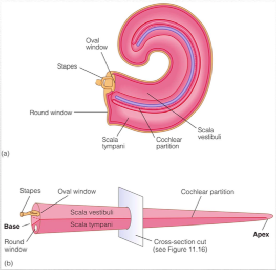
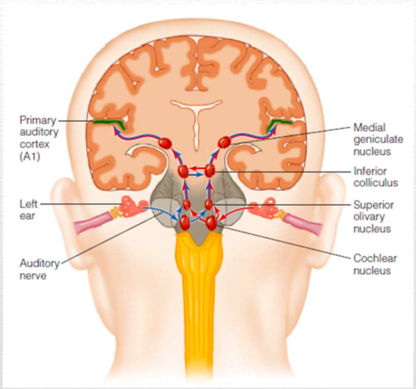
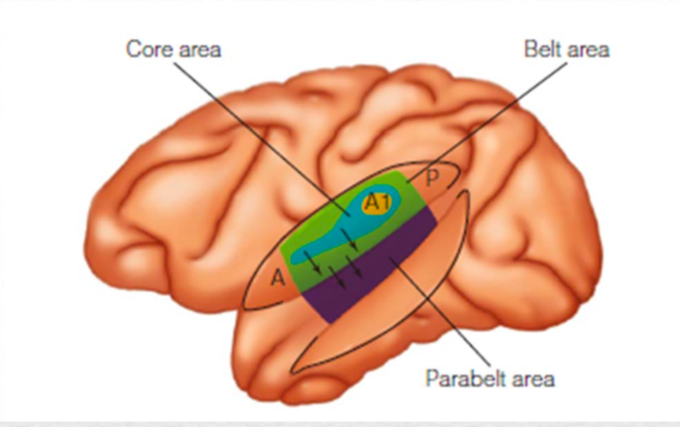
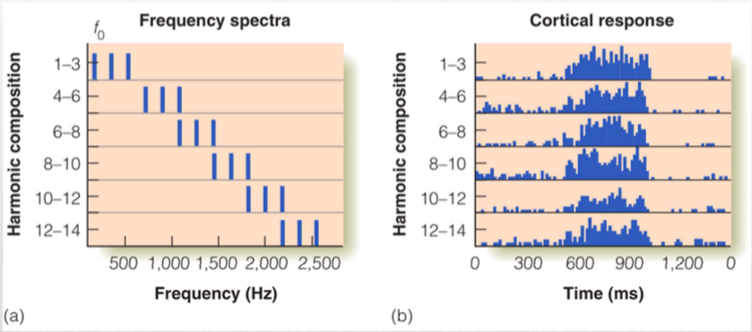
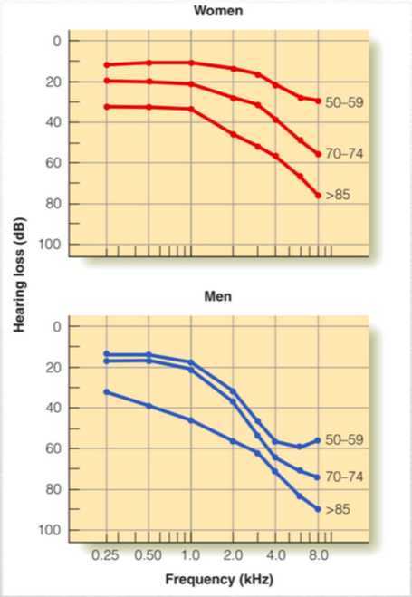

---

typora-copy-images-to: ../Wiki Img
---

Early Auditory Processing
======

[TOC]

听觉系统大致的结构是 声波通过外耳, 中耳传导到耳蜗. 激活hair cell

**Questions**

* Anatomical Pathway
* Physical/Engineering function?(Physical-Electrical-Neural code transduction 换能)
* Computational Function
* Processing of Auditory neural code at each stage

**Note**: auditory relay to cortex is much longer than visual !! 

Synfire Chain? Why and where?

## Auditory Pathway

Ear: Outer Ear(Ear Canal)-Middle Ear(Ear drum,Hearing bones)-Inner Ear(Cochlear)

## Ear

Outer ear-middle ear(ear drum)- 

### Outer Ear

**耳廓** 是收集声音, 可以帮助声音定位【造成声音前后的不对称性

**耳道** 

- 保护中耳的精细结构！
- 保护鼓膜, 分泌Wax 
- 作为空腔(谐振腔) 可以物理放大一部分声音强度! 1000-5000Hz的频率的声音

### 中耳

三块听小骨，听骨链，锤骨Malleus 砧骨Incus 镫骨Stapes

- 可以机械放大声音！
- 机械波从空气传输到水中会有极大的能量损失(剩余1%)，所以需要用Ear Drum - Oval Window提高压强！
  - 比如鱼生活在水里就不需要

中耳肌肉，是人体最小的的骨骼肌，控制听小骨。

- 其收缩可以屏蔽一些低频噪声，如咀嚼声音
- 强的声音输入时会反射性收缩，保护耳朵

## Cochlea

###内耳

**耳蜗Cochlea** 内耳最关键结构

- 分为上下两部分Scala tympani, Scala vestibuli，Cochlea
- 从Oval Window到内部的Apex

### Basilar Membrane

**Organ of Corti**: 

**纤毛**: 纤毛向两个方向弯曲 导致离子通道打开，转换成电流输入，发放

**Hair Cell**: 用于转换机械形式到电形式分为 Inner Hair Cell与Outer Hair Cell

- 其中Hair cell 可以类比成视锥 视杆细胞的漂白过程. ! 

**Phase locked Firing**: 

* Firing pattern每个神经细胞不会在每个峰处都有firing，但是population level会有firing rate的时间变化曲线。
* 属于Temporal Coding，5000Hz以下的处理基本都可以如此. 
* 注意5000Hz以上就很难听出来音色了. 

**Vibration of Basilar Membrane**

* 行波学说, 不同的频率声音在传入Cochlea之后的产生的基底膜的震动的峰值在不同位置. 

**Place Theory of Hearing** 

* 由于Basilar Membrane的机械力学性质，
* 形成Tonotopic map，随着Basilar Membrane从Base 到Apex连续变化。

如果输入Complex tone, 则每个位置对应一个峰值

* 所谓 Acoustic Prism，声学棱镜，一个Harmonics被分成不同频率，激发BM不同位置的最大幅度的震动。 

## Auditory Nerves

Neural Fibers

## Subcortical nuclei

类似视觉有功能分流: What and Where

* Ventral (Stria): Biaural sound localization
  * Superior olivary complex(SOC): 双耳时间、强度比较的circuit
  * Nucleus of lateral leminiscus: 
* Dorsal (Stream/Stria): Identification
  * Cochlear Nucleus: 
  * Inferior Colliculus: 
* Inferior Colliculus: 汇集了location identity信息, 
* Thalamus Relay: Medial geniculate nucleus (MGN): 
  * Principal Neuron : 被认为是传递/接力频率 响度 双耳时差信息到皮层的.
  * Intrathalamic Interneuron circuit: GABA抑制性的, 连接比较复杂, 有些投射PN (抑制兴奋性的) 有些IN (抑制抑制性神经元). 

## Auditory Cortex

Crucial to the perception of sound!! (before reaching cortex, sound can evoke reflective responses, but subject is not aware)

Functional Connectivity 可能非常复杂!! 受到基因 生活史 高层脑区的调控

Cortex区域相比于下层区域拥有更大量的神经元数目, 更复杂的interaction方式, 更大的Plasticity, 也接受更多的反馈(可以select response)

声音的识别(identification)与定位(localization)在早期pathway分开了, 后面逐渐合起来. 

**解剖分区**: core; belt; parabelt

* Core 包含 AI(Primary Auditory Cortex) ; Belt等在周围环绕
  * 依照Cell type长相, 与Thalamus的连接, 染色, Tonotopic轴的存在来分区
* AI(PAC)
  * PAC, 还有部分Belt区域有Tonotopic / Place code organization: Cortex 上位置和特征频率相对应, 可以与频率轴建立连续映射(同胚Homeomorphism)
    * 此Tonotopic map与成长环境有关, 老鼠发育早期(>30D就没用了)给他放宽频带噪音 会让tonotopic map 乱掉!!宽频带噪音使得**很大频率范围的neuron同时被激活**. 而且receptive field degrade: 容易出现multipeak receptive field, 频率tune范围更广. 这两种tuning cell的出现频率远大于控制组的! 而且有关键期 超过这一关键期就不会有问题了~[Disruption of primary auditory cortex](http://www.pnas.org/content/99/4/2309.full)
  * 等特征频率线正交于频率轴, 形成Frequency band strip
  * 单个neuron的tuning curve很多样化: 单个峰(sharp tuning), (Broad tuning), (最大响应强度/ 不封顶), 多个峰(Multipeak) 有些多峰有Harmonics的关联, 有些没有
* Outside AI
  * 对复杂刺激响应更强: 不同频率组合, AM tone

### Primary Auditory Cortex

Location 功能: Auditory Cortex损伤,会影响对侧的声音定位! (Behavioral relavant)

Object Representation: 某种听皮层 Activity pattern代表着客体对象Object. 

Tone evoked potential? 

存在**Pitch Neuron**: 即对基频/Fundamental Frequency/Repitition Rate有关联

Cf. Xiaoqin Wang的听皮层研究

## Psychiatry

**Presbycusis 老年性耳聋.** 

* 毛细胞退化: 老年人的毛细胞会容易退化因此tuning curve变宽. 对高频声音听起来听不清. 且男性更容易如此. 
* 似乎是与长时间噪音暴露有关. 安静的环境更不容易退化

Cf. Presbyosis老年性花眼

## Development

