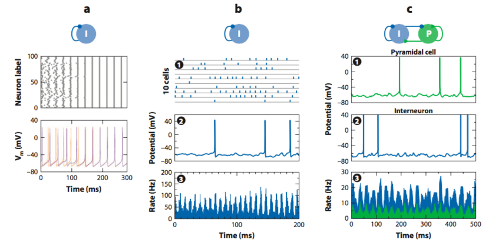

## Mechanisms of Gamma Oscillation

Annual Review Neuroscience

Gamma band: Frequency 30-90Hz (timescale 10-30ms)

### Dynamic Cell Assembly

### Models

存在几种不同的Gamma Oscillation模型, 但共同的是 Inhibition / interneuron是关键的. 光是Excitatory出不来Oscillation.  当然光是Inhibition连spike也不会有, 所以Interneuron也需要外界的drive来fire, 有了fire才能有Oscillation

Gamma Oscillation作为一种Oscillation, 其特定的Frequency由一系列的time constant决定. 如Membrane, Conductance (AMPA, GABA_A) 等等. 

### E-I model

最早的Gamma Oscillation模型: 两个Population一个兴奋一个抑制, 彼此投射 也有自身的recurrent, 兴奋性population投射给抑制性. (通过Pyramidal Neuron与Interneuron的Interaction来实现的Synchronization) 

**特点** 

* **E I population之间Oscillation有Phase shift**, 两Population之间不Synchronize. 此Phase shift与Axon delay, Synapse delay有关. 
* 这些Delay决定了Oscillation Frequency. 

### I-I model

* 一个Inhibitory Population在有外界Drive输入下, 自己Inhibit自己, 从而Periodically Fire起来. 在这个模型中, Interneuron自身是产生频率的主体, 
* Inhibitory cells 一起产生一个large Synchronized IPSP, 然后在drive下Hyperpolarization逐渐decay. 从而能再次一起fire. 

**特点** 

* Interneuron之间Mutual Inhibition是关键! (Increased firing of synaptic coupled interneurons)
* 决定频率的是IPSP的timecourse 以及外界drive的强度

### Interneuron circuit

## Distinct Inhibitory Circuits Orchestrate Cortical beta and gamma Band Oscillations

[Distinct Inhibitory Circuits Orchestrate Cortical beta and gamma Band Oscillations](http://www.cell.com/neuron/fulltext/S0896-6273(17)31086-3)

[Paper Note](..\Paper Reading\Inhibitory Neural Circuit.md#Distinct Inhibitory Circuits Orchestrate Cortical beta and gamma Band Oscillations)

**Question**: 不同类interneuron 与不同band Oscillation相关? 怎么做到的?

- Gamma/Beta Oscillation指的是那种方式记录找到的Oscillation. 是LFP还是Spike Train还是什么? 是Periodicity还是FFT之后Spectrum的改变?
- 背后的Neural circuit与Dynamics是什么? 
  - 是因为两种Neuron的内部属性(time const)不同, 因而诱导的Oscillation的频段不同?
- 从这个Dynamics现象怎么去探究Circuit连接信息? 

## Function of Gamma Oscillation

许多理论家提出了许多Gamma Oscillation的作用: 比如

* 增强response, 作为Attention的机制. Fries 2001
* 使得不同脑区之间得以"交流", Binding 同一个刺激的不同方面. 
  * 一个Oscillation是怎么作为交流渠道的? 
* 作为类似计算机主频时钟的"Clock"
* Fries 2007, Oscillation提供了一个时间参照系, 因而每个Spike相对于此Oscillation的phase可以encode信息. 
  * Gamma Oscillation如何作为时间参照系 (Buzsa ́ki and Chrobak, 1995; Hopfield, 1995; Whittington et al., 1995; Cardin et al., 2009).

## Is gamma-band activity in the LFP of V1 cortex a "clock" or filtered noise?

Burns SP, Xing D, Shelley MJ, Shapley RM (2011) Is gamma-band activity in the local field potential of V1 cortex a "clock" or filtered noise?. J Neurosci. 31:9658-9564 [ [pdf](http://www.jneurosci.org/content/31/26/9658) ]

[Paper Note](..\Paper Reading\Gamma Oscillation.md#Is gamma-band activity in the LFP of V1 cortex a "clock" or filtered noise?)

**实验系统**: 猴子V1, LFP

**结果**: 发现LFP中Gamma频段的Burst与被Filter的Noise不可区分. 不能作为一个Clock, 但是可以作为一个Synchronized burst signal

**Question**: 什么样的信号可以作为Clock? 可以有Binding 作用. 

* 时钟信号应当有稳定的频率 以及稳定统一的Phase, 许多个Period中都保持着近乎同样的Phase. 
* 做模型是保证什么与LFP一致, 什么不一致? 
  * Spectrum相对应, 但其时域上的feature不一定一致. (**Match频域, 比较时域**)
* 做的Bursting模型是不是太狭窄了? 如果加入更多种类的Bursting 而非频率集中在某处的 是否会好些. 
  * 这是Argument的关键. 即如果能作为时钟则 其频率应该较为稳定, 而且在一个波包中Coherent, 相位不变. 

###  Method

* 测量Time scale与Frequency的分布, 
* Drifting Grating 刺激猴子. 得到Stimulated LFP. 不刺激时的LFP spectrum是Spontaneous Spectrum
  * 从真实的LFP中抽取Bursting events, 找到其Frequency, Amplitude, Duration(timescale)
* 建立了两个模型, Noise与Burst模型. 做统计分析, 比较其Statistics与实际测量到的LFP 的相似度, 做统计检验. 发现与Noise模型更接近. EE

**Noise**

* Broadband Gamma Noise
* 直接用Stimulated Spectrum 加入Random Phase (phase shuffling) 作IFFT即得到Voltage. 也就是说随便一个这样频谱的信号, 都有接近LFP的bursting分布. 
* 怎么去理解这个模型? 
  * Nework只是在做一个Filtering, 相当于提升/放大了某个频段的神经输入. 
  * Mechanistically, 在有视觉刺激的时候, 什么在做Filtering?网路dynamics?

**Burst**

* 在Spontaneous Spectrum上加入Random Phase, 再在时域Voltage上加入合适频率的Bursting, 使频谱与Stimulated情形一致. 
* 认为Spectrum上的Gamma band突出来自于时域上的一些Coherent Bursting Packet. Cf 光学频谱上的峰对应时域上的一个波包. 故在时域上加入一些Burst使之后的频谱与Stimulated Spectrum matching. 

$$
Time: V(t)= Ae^{-(t-t_0)^2/2\sigma^2}e^{i\omega_0t}. \\
Freq: V(\omega)=Be^{-1/2(\omega-\omega_0)^2\sigma^2}e^{i(\omega-\omega_0)t_0}.
$$

