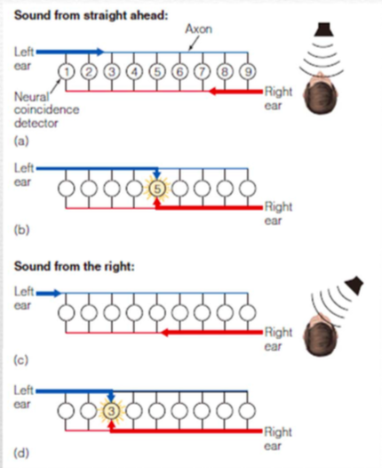

# Sensory System

(Reading note from 23 Questions)

Stimulus->Neural Code

General Problems in [this area](..\neuroscience.md#I/O-system-(Perceptual-psychology-&-neuroscience))

* What is Neural Code
  * Basically, Spike train. But what's the meaningful "words" constructed by these "symbols" / "letters"
  * *Code*, the relation between arbitrary symbols to meaningful things ! 
  * *Code* as a kind of decipherment of language. (Thomas Young)
* What the Code is used for
* Early sensory (visual) system as a model
  * We know the information flows in, and has an estimate of what the code carries. 

## Firing rate code

* Rate change constantly with stimulus
* Definition of Firing rate? 
  * Average by population? 
  * Average by trial? 
* Cons:
  * Inter Spike Interval changes drastically!! Not a constant frequency firing train. 
    * Due to Poissson variability? Thus it is noise
    * Variable ISI carries information?
  * Spike number change with trial !! 
  * Seems really **inefficient**!! Single Neuron single spike cannot say much
    * UCL [Ruling out and ruling in neural codes](http://www.gatsby.ucl.ac.uk/~pel/papers/jacobsetal_pnas_2009.pdf) 
  * **A1 does not use Rate code**: 
    * Single firing only once

**Regular firing VS Irregular firing**

- Unsynchronized network
  - Regular firing is a result of Central limit theorem (uncorrelated i.i.d input train sum up to constant)
  - i.i.d input leads to near constant current!! 
  - High variability happen when input is near threshold, while firing rate will be low. 
- Total synchronized network
  - Whole network periodically work
- **Irregular Firing**? How?
  - Totally Excitatory
    - Hard to be irregular if connection is dense 
  - [Excitatory and Inhibitory](./Excitatory Inhibitory Balance.md)
    - Chaotic behavior of balanced network: van Vreeswijk and Sompolinsky 1996, 1998
    - [Reyes : Synaptic Scaling rule](https://neurophysics.ucsd.edu/courses/physics_171/Barral_Reyes.pdf): $S\propto 1/\sqrt{K}$   
    - Needs no precise tuning. The balanced state is evolved into
    - Property
      - Rapid input change response time. 
- Multiple Firing Events

## Temporal Code

Timing of firing carries information. Few theoretical work, most remarkable: 

* Synfire chain (1991 Abeles)
  * Redundancy in each neural population, and dense feedforward connection cause synchronization in one group and stable timing porpagation. 
  * **Testing**: The model could be tested, if there are stable timing triplets t1-t2-t3 (or more group) occuring in population raster! 
    * What's the Non-hyothesis? 
    * Better Statistical Test may falsify the result
  * For I&F neurons, the synaptic strength change the spike timing (first arrival time). So the Synfire chain with platicity can be **unstable**? (P271)
* PNG Polychronous Neuron Group( Izhikeviche )

### Interval Coding

**AM Oswald,**, B Doiron, L Maler (2007) Interval Coding I: Burst interspike intervals as indicators of stimulus intensity. *Journal of Neurophysiology* 97: 2731-2743. -Editorial Focus, *Journal of Neurophysiology* 97: 2577-2578. [pdf](http://www.pitt.edu/~amoswald/2007a_JNeurophysiol.pdf) 

B Doiron, **AM Oswald**, L Maler (2007) Interval Coding II: Dendrite dependent mechanisms. *Journal of Neurophysiology* 97: 2744-2757. -Editorial Focus, *Journal of Neurophysiology* 97: 2577-2578. [pdf](http://www.pitt.edu/~amoswald/2007b_JNeurophysiol.pdf) 

## Correlation Code

von der Malsburg 1985

* Firing rate coding has problem with binding 
* Evidence
  * A1: 
  * V1: Synchronization arise with certain images (How to measure [Neural Synchronization]()?)

## Place Code

**Auditory system**

Frequency is coded in position of neuron in cochlea and auditory cortex. 

In the Jeffress model, Interaural Temporal Difference Detection can be coded in the position. As different ITD signal will coincide on different neuron in the field. Thus the ITD can cause a bump of neuron to fire on the transport axis. 

## Optimal Coding and Sparsity

What is the **Optimization problem** ?

* Optimal coding of visual system (Olshausen and Field 1996, 1997)
  * Question : Best encoding system (transform $W$ from feature to response) that can be decoded in face of noise. 
  * Constraint : 
    * Output firing rate should be limited. 
    * Add sparseness as constraint of optimization
  * Sparseness seems to say, different neurons code different features! 
    * May not true !! 
* van Vreeswijk (2001) [Source of sparceness](http://papers.nips.cc/paper/1884-whence-sparseness.pdf)
  * Information transmission with renewal neurons [van Vreeswijk (2001)](http://www.sciencedirect.com/science/article/pii/S0925231201003599)
    * [[Renewal Process]](../Mathematics/Stochastic Process.md# Renewal Process)
  * [Coding with Balanced Spiking Network](http://iec-lnc.ens.fr/IMG/Files/CA8b-balanced.pdf)
    * ​

* [Optimal coding of Olfactory system](Olfactory.md)
  * Compress Sensing Framework 

[Information entropy](..\Mathematics\Information theory.md#Information-Entropy) of a Neural spike train depend on the statistical model!! And the space of possible apike train. 

Q: What constraint should we put on spike train ? 

## What is population coding?

Why Population ?

* Sampling from random variable distribution?
* Other global transform multivariables? 

[Population Coding](Population Coding.md)

## Invariant / Graded transfer of Code

