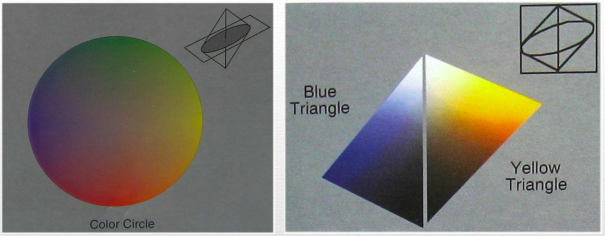
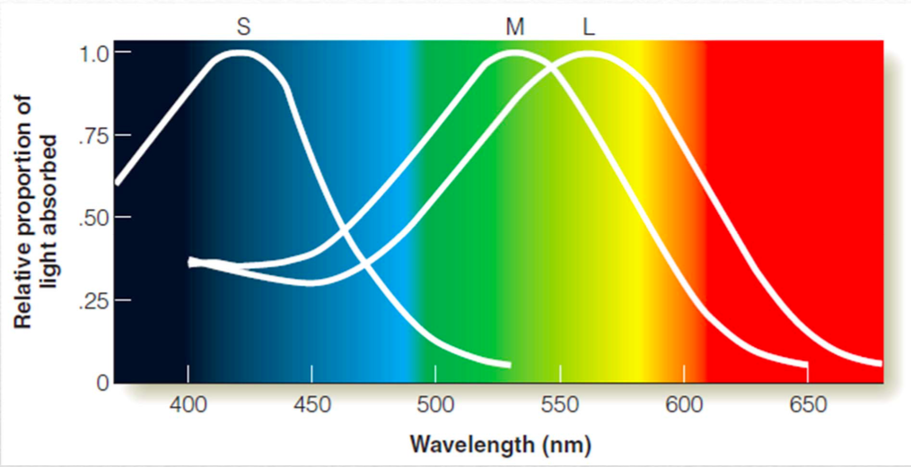
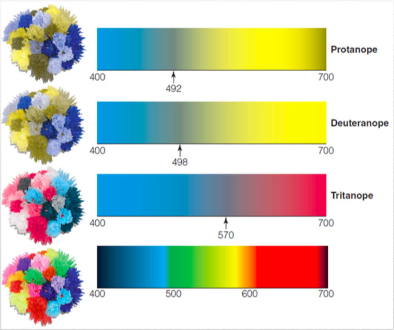

Color Perception
======

## Color Space

本质是三维流形, 不过有universal map, 大致是两个椎体粘和合起来的, 两个锥顶点是白与黑

* Hue: 
* Saturation: 颜色饱和度, 多么接近
* Lightness: 近似代表光度
  * Cf. Brightness: 反射率* 照明强度

## Physics of Color

可见光谱范围400-700nm

Color 来源于带颜色/不带颜色的光线被物体反射/被物体投射, 进入人眼的光谱. 

**混合光线 vs 混合颜料**

* 混合光线导致入射人眼的光谱更明显.
* 混合颜料导出选择性吸收更厉害

## 三原色理论 Trichromatic Theory

用三种颜色(光)可以调出各种颜色/光

**生理学证据**: 对应于Retina的三种Cone 

**Color Metamer**: 由于只有三种Cone, 所以可能两种不同的Physical光谱组成, 可以形成完全相同的Cone信号, 完全相同的Perception不会有区别. 

双眼加工与知觉

[单眼知觉 信息是不能被意识Access的, 很难分辨光刺激到底是从哪只眼睛进来的! 

两种视锥细胞基本也能区分三种颜色

## Color Deficiency

通常认为是视网膜 视锥细胞的问题导致色盲 色弱

### 检测Color Deficiency的方法

* Ishihara Plates: 
* Color matching procedure: 
  * 让被试去调节三个组分看能否匹配颜色与

### Classes

**Monochromatism**: 单色色盲, 对强光非常敏感 无法睁眼. 

**Protanope / Deuteranope**红绿色盲: 双色盲, 

* 从X染色体遗传, 男性比较常见

**灰点**: 由于两种椎体反应类似, 因此无法分辨此颜色和灰黑色. 对于不同的双色色盲, 灰点位置不同. 

**Tritanope**: 

* 

## Opponent Processing Theory

**After image**视觉后象: 

**色彩组合的证据**: 黄绿, 红蓝可以想象, 红黄, 蓝绿可以想象, 但红绿 黄蓝不可想象 

拮抗加工理论: 有黑白B-W+, 黄蓝Y+B-, 红绿R+G- 三种不同的通路, 

在LGN中可以找到三种不同的Code颜色的细胞. 

Opponent 和 Chromatic Adaptation相关

## Color in Cortex

**Achromatopsia**称为皮层色盲: 

**Opponent Cell**: Cortex中能检测两种颜色拮抗的细胞

颜色可以帮助检测

## Lightness constancy

**Ratio Principle**: 关心的是相邻区域的Ratio比例, 而非绝对亮度. 

* 人会把环境中最dark的部分perceive为黑, 其他为颜色

如何区分Illumination Edge与Reflectance Edge

* Illumination Edge 来自阴影, 通常阴影的黑度有限, 而且会有模糊现象
* Reflectance Edge来自物体材料本身的反射性质变化, 通常比较sharp
* 3D信息, Surface朝向信息 影响 亮度知觉. 
  * 大范围的3DContext可以改变基本的perception, 以及基本的运动信息

## Color Constancy

不同光照条件下如何把客体颜色知觉为一样的…?

**Color Adaptation**: 一直盯着看红色, 看到的红色就越来越弱, 最后像灰色了

* 看红色surface时间太长, 管红色视锥细胞会被Bleach掉于是就不反应了. 
* 

颜色恒常性 需要

人在adapt时会逐渐discount掉环境光的影响

* 对于客体颜色的记忆 知识会

## Infant Color Vision

注意: 色度, 亮度问题注意亮度匹配. 

