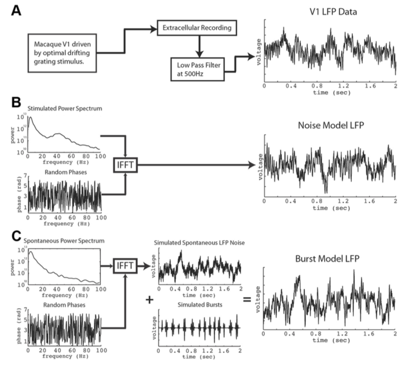
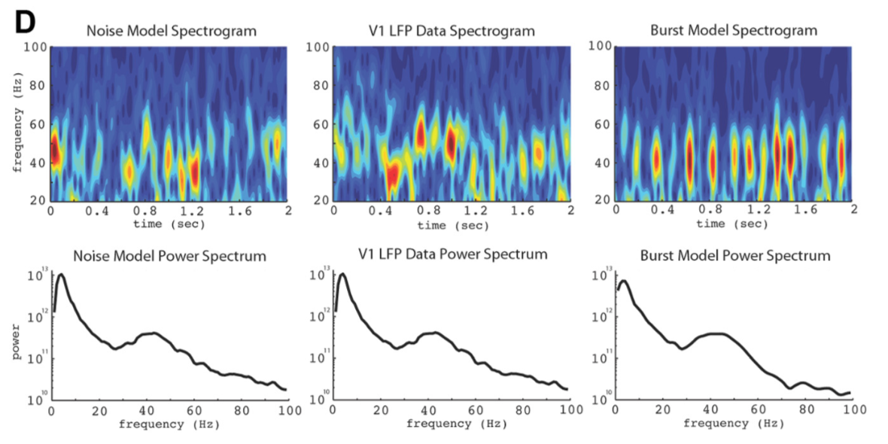
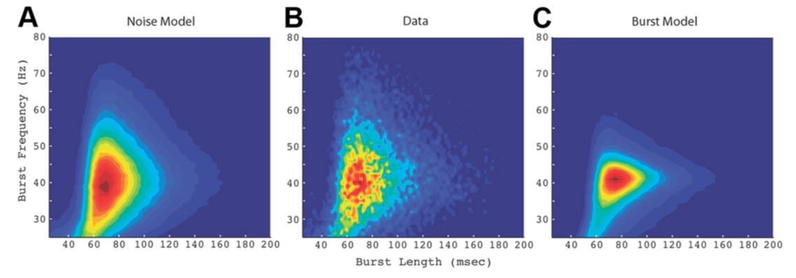

## Is gamma-band activity in the LFP of V1 cortex a "clock" or filtered noise?

Burns SP, Xing D, Shelley MJ, Shapley RM (2011) Is gamma-band activity in the local field potential of V1 cortex a "clock" or filtered noise?. J Neurosci. 31:9658-9564 [ [pdf](http://www.jneurosci.org/content/31/26/9658) ]

**实验系统**: 猴子V1, LFP

**结果**: 发现LFP中Gamma频段的Burst与被Filter的Noise不可区分. 不能作为一个Clock, 但是可以作为一个Synchronized burst signal

**Question**: 什么样的信号可以作为Clock? 可以有Binding 作用. 

- 时钟信号应当有稳定的频率 以及稳定统一的Phase, 许多个Period中都保持着近乎同样的Phase. 
- 做模型是保证什么与LFP一致, 什么不一致? 
  - Spectrum相对应, 但其时域上的feature不一定一致. (**Match频域, 比较时域**)
- 做的Bursting模型是不是太狭窄了? 如果加入更多种类的Bursting 而非频率集中在某处的 是否会好些. 
  - 这是Argument的关键. 即如果能作为时钟则 其频率应该较为稳定, 而且在一个波包中Coherent, 相位不变. 

### Method

- 测量Time scale与Frequency的分布, 
- Drifting Grating 刺激猴子. 得到Stimulated LFP. 不刺激时的LFP spectrum是Spontaneous Spectrum
  - 从真实的LFP中抽取Bursting events, 找到其Frequency, Amplitude, Duration(timescale)
- 建立了两个模型, Noise与Burst模型. 做统计分析, 比较其Statistics与实际测量到的LFP 的相似度, 做统计检验. 

**Noise**

- Broadband Gamma Noise
- 直接用Stimulated Spectrum 加入Random Phase (phase shuffling) 作IFFT即得到Voltage. 也就是说随便一个这样频谱的信号, 都有接近LFP的bursting分布. 
- 怎么去理解这个模型? 
  - Nework只是在做一个Filtering, 相当于提升/放大了某个频段的神经输入. 
  - Mechanistically, 在有视觉刺激的时候, 什么在做Filtering?网路dynamics?

**Burst**

- 在Spontaneous Spectrum上加入Random Phase, 再在时域Voltage上加入合适频率的Bursting, 使频谱与Stimulated情形一致. 
- 认为Spectrum上的Gamma band突出来自于时域上的一些Coherent Bursting Packet. Cf 光学频谱上的峰对应时域上的一个波包. 故在时域上加入一些Burst使之后的频谱与Stimulated Spectrum matching. 

$$
Time: V(t)= Ae^{-(t-t_0)^2/2\sigma^2}e^{i\omega_0t}. \\
Freq: V(\omega)=Be^{-1/2(\omega-\omega_0)^2\sigma^2}e^{i(\omega-\omega_0)t_0}.
$$

- 在Spectrogram上看, 每次Burst时, Gamma band 的Power会显著增强. 

然而去比较时域上Bursting events的Feature分布, 很不一样. 

- 此处用CGT来识别Bursting, 即当Gamma band power增加则有burst, 然后当phase比较一致时认为是coherent的. 若偏离较多则不coherent. 

综上, 认为看到Spectrum上Gamma band bump就认为是一个Regular deterministic harmonic Oscillation是不靠谱的. 没有那么规整! 

- 作视觉刺激时, V1的LFP在不同的V1区域 Gamma band peak可能很不同. 

