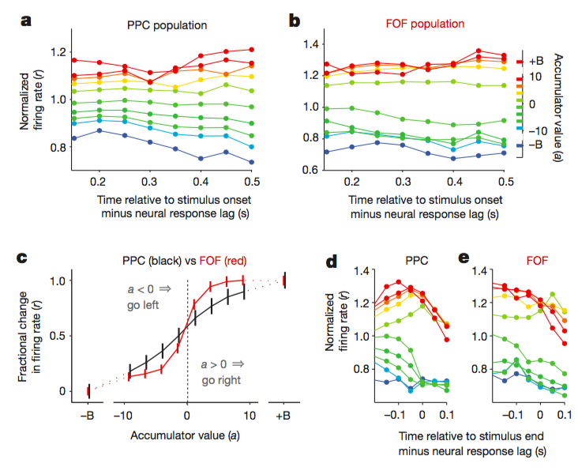
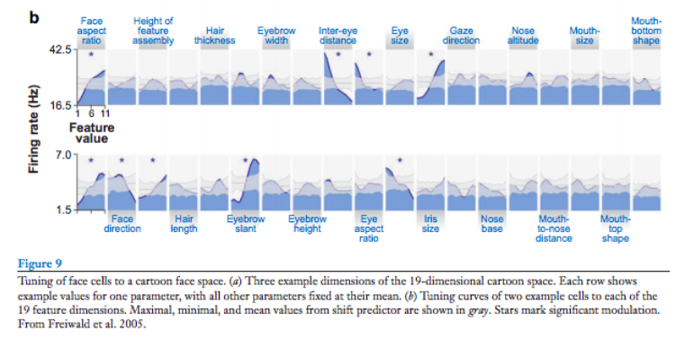

## Selective and graded coding of reward-uncertainty by neurons in the primate anterodorsal septal region

https://www.ncbi.nlm.nih.gov/pmc/articles/PMC4160807/

[Ilya E. Monosov](https://www.ncbi.nlm.nih.gov/pubmed/?term=Monosov%20IE%5BAuthor%5D&cauthor=true&cauthor_uid=23666181)1 and [Okihide Hikosaka](https://www.ncbi.nlm.nih.gov/pubmed/?term=Hikosaka%20O%5BAuthor%5D&cauthor=true&cauthor_uid=23666181)1

ADS区(anterodorsal region of the primate septum (ADS)) 有些neuron 对于代表不确定reward出现的cue有反应, 对于代表稳定出现的reward(0% 100%)无反应! selective与Graded的coding

**方法**: 猴子行为实验 以及

## Distinct relationships of parietal and prefrontal cortices to evidence accumulation

Timothy D. Hanks1,2*, Charles D. Kopec1,2*, Bingni W. Brunton1,2,3, Chunyu A. Duan1,2, Jeffrey C. Erlich1,2,4 & Carlos D. Brody1,2,5

posterior parietal cortex PPC 与 frontal eye fields FOF编码证据强弱

## A face feature space in the macaque temporal lobe

https://www.nature.com/articles/nn.2363

Doris Tsao

Face patch code of human face feature. 

* 核心是macaque IT neuron 连续编码着人脸对标准脸的偏离模式. 

## Mechanisms of Face Perception

http://www.annualreviews.org/doi/abs/10.1146/annurev.neuro.30.051606.094238

