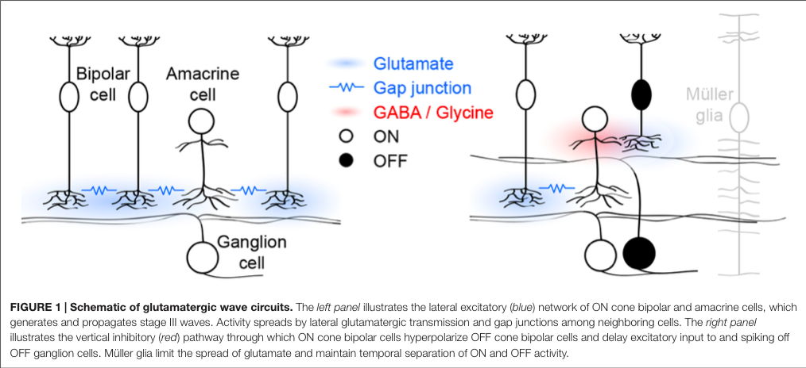

# Basic Knowledge

Retina Ganglion Cells(RGC): Retina output neuron

* excitatory input from bipolar cells
* inhibitory input from amacrine cells

## Inhibitory Control of Feature Selectivity in an Object Motion Sensitive Circuit of the Retina

2017 Tahnbee Kim1,2 and Daniel Kerschensteiner

http://dx.doi.org/10.1016/j.celrep.2017.04.060

总结: 一种分离出客体运动, 而非视场整体运动的Retina Circuit! 由Inhibitory circuit 诱导! Mice W3 RGCs. Excitatory input使之对局部运动有响应, inhibitory input 让它对整体运动Silence. 

Retina 40种RGC cell, 超过50种不同的inhibitory neuron (amacrine cell AC), 或许是大脑中inhibitory diversity最大的一块. 

**Circuit**: W3-RGC 接收bipolar cells的Exc与 VGluT3-expressing ACs (VG3-ACs)的抑制. 

如何分离局部(客体)运动, 与整体(主体)运动的呢?(*注意整体视场运动就会引起主体运动的感觉~*)

- ​

## Glutamatergic Retinal Waves

Review

Daniel Kerschensteiner

http://kerschensteinerlab.wustl.edu/_pdf/KerschensteinerD-FrontNeuralCircuits-2016.pdf

# Circuit Development

## Homeostatic plasticity shapes cell-type-specific wiring in the retina

Tien NW, Soto F, Kerschensteiner D. Homeostatic plasticity shapes cell-type-specific wiring in the retina. Neuron 2017 [pdf](http://kerschensteinerlab.wustl.edu/_pdf/TienNW-Neuron-2017.pdf)[supplement](http://kerschensteinerlab.wustl.edu/_pdf/TienNW-Neuron-2017_suppl.pdf)

## Coordinated increase in inhibitory and excitatory synapses onto retinal ganglion cells during development

Soto F, Bleckert A, Lewis R, Kang Y, Kerschensteiner D, Craig AM, Wong RO. Coordinated increase in inhibitory and excitatory synapses onto retinal ganglion cells during development. Neural Development 2011 6(1):31. [[pdf](http://kerschensteinerlab.wustl.edu/_pdf/SotoF-NeuralDev-2011.pdf)]

问题: Exc Inh balance是怎么达到的. 

方法: 用一种转基因方法, 给post synaptic site上荧光标记. 

发现: 似乎在开眼看世界之前, Exc与Inh post synapse site的比例就很固定了, 与成年鼠的比例类似. 

