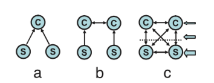
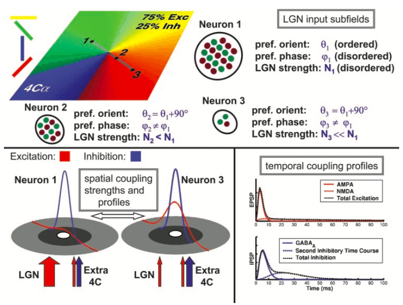

## Energy model 

## Spike Triggered Average / Covariance

## Convolutional Subunit V1 model 

## Egalitarian Neural Network model

PNAS 2004

试图一起解释V1 Simple Cell, Complex Cell, 试图削弱两者之间的界限, 削弱Hierarchical的性质. 两者的差别是定性的, 输入更多来自Cortex还是输入更多来自Extra cortical input. 

**Model**: Conductance based I & F neuron, with Exc, Inh inputs together, shaping the reverse potential and Conductance together. 

* Excitation and Inhibition recurrence of different extant. Cortico-Cortico Inhibition的作用, 
* ​

**Statistical model of V1**: 加入了许多Biological Detail. 

**Test**: 

* ​

**Question**:

* 这个模型能解释LFP之类的东西吗?

Shapley's response: Inhibitory input time course should be different from excitatory. Inhibitory has longer decay time scale. And feedback is very important. 

