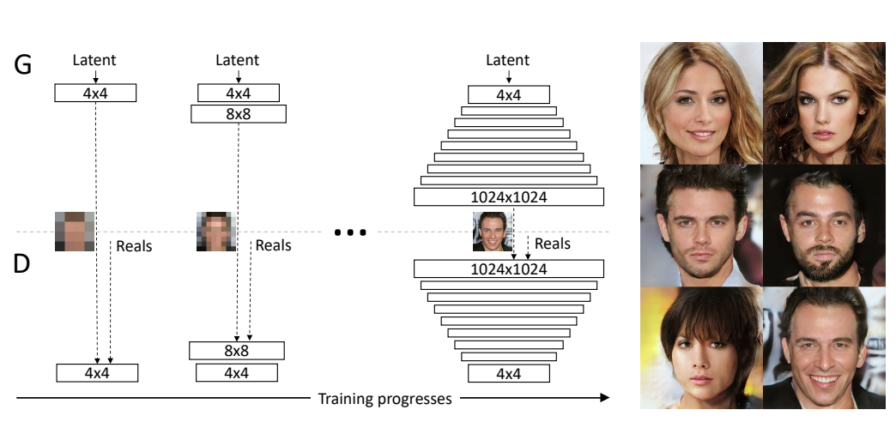

# Computational Photography

* TOC
{:toc}
> Basically, enhance image by computation! 

Intersection of 3 fields 

* Optics
* Vision 
* Graphics 

Majorly two kinds of work

* Co-design camera and image processing (optics + vision)
* Use Vision to help Graphics to help generate better image faster! 

# CG2REAL

CG rendering is very computational intensive! 

* Shape model 
* Texture model
* Light transport is complex (huge number of )

How to make the expensive photorealistic rendering cheaper? 

* Vision can help to swap in basic texture and object info into roughly rendered image (Use NN to enhance rendering! Add details to it! )

Johnson, CG2REAL 2010

**The Pre-CNN Pipeline**

1. Find most similar images to a given one 
   * E.g. using SIFT keypoint features and match the descriptors
   * Similar to [content based image retriviel](Semantics-Vision-Task.md#Content-Based-Image-Retrieval) 
2. Co-Segmentation. 
   * MRF based way
3. Local Style Transfer 
   * On matched region of source and target image. 
   * Match intensity and gradient histogram, in order to transfer texture. 

**Comments**

* So-called image based rendering: doesn't go back to physics, just render image better based on a given image. 

# SEAM Carving

> Classic powerful algorithm. Extremely simple! Directly goes into Photoshop....

> How do you Resize a image and keep most of the interesting regions cleverly?

* *Crop* : 
* *Imresize* : may force you to crop out interesting parts. 

Both of them are suboptimal. Try to keep interesting part, merge different part together. By throwing away uninteresting pixels! 

* SEAM Carving

**Basic Idea**: 

* Each time delete a curved horizontal line and a curved vertical line. Then the image will have -1 row and -1 col! 
* Find this curved line by some optimization (path programming).

**Optimization Setup**

Define the line as $y[x]$ (horizontal curve). Variational energy minimization. The Energy function reads 

* Connected line constraints between neighbors $\|y[i+1]-y[i]\|\leq 1$ 

* Pixel-wise energy term can be as simple as gradient energy.  $e[x,y]=\|\nabla I\|^2_2$ 

Thus it's a chain structure MRF, **Viterbi Algorithm** solve this. See [Stereo Vision]()

Forward Backward Algorithm. 

1. Propagate from left to right, accumulate a cost matrix `[h,w]`
2. Collect from right to left. 

Actually the smoothing cost is much simpler than the stereo case! 

How should you remove X row and Y col? In essence a path programming on square grid. 

* Each time compare a row SEM and a col SEM, compare the cost. 

## Content Amplification

## SEAM Insertion

Find all the SEAM curves passing through the image 

## Object Removal 

Annotate and segment out an object! Add high energy on anywhere except your object. 

> This is the basic framework for image-retargetting. 

**Following research ** 

* Come up with better energy function than gradient energy
  * Saliency map is connected to this, saliency map is the enegy map for interesting regions on the image. 
* Insert a forbidden region (like face detector) that SEAM cannot go through! 
* Insert a region of interest that SEAM has to go through! 

# Texture Synthesis

Taking a sample texture patch. 

* Crop out smaller patches, paste them on your canvas randomly. 
* Paste one patch, paste another patch by finding the best patch matched well to the boundary of the old patch. 

> Simple but super impressive algorithm.  

## Texture Transfer

Paster the texture patches on the new image of the object, by finding the closest mathcing patch from the original texutre template. 

# Neural Style Transfer 

Match the covariance matrix (Gram Matrix) of the channel-wise feature vector! in 2 feature tensor produced by 2 CNNs. 

# Poisson Image Editting 

> Another Classic algorithm that works super well with simple ideas. 

> How do you transfer gradient from one image to the other. 

**Mathematical Observation** 

* Gradiant image  $\nabla I$ plus a reference absolute value, can give back your image by path integration! (Poisson PDE problem)
  * But you don't really care the integratability ! 
* Editting gradient is easier than editting  pixel values. 

**Poisson Solver** : 

* Solve a linear least square problem defined by finite difference ! 
* Or solve it in the Fourier Domain. 

Same as the process of going from normal vector to depth in classic stereo! 

> The more general lesson is in **some domain / representation** manipulation is more **intuitive** and easier than other domains, thus easier for us to do editting! Seems gradient is more natural than direct pixel. 

**General Process**

* Get a gradient image by filtering 
* Manipulate an image by inserting or deleting gradient in a domain. 
* Re-run the poisson solver to integrate the image back. 

**Application**

* Texture Flattening
  * Set a region's gradient to zero make the texure in one region flat! 
* Object insertion: 
  * Copy gradient instead of copy pixel value *per se* 
  * The object can blend much better to the environment! Water color and lighting can be transferred from neighboring pixels. 
* Translucent image copying 
  * Alpha blend or Max blend the gradient of source and target, instead of just copy. 

CG2REAL actually uses this technique to match the gradient histogram in 2 regions. (match the histogram of gradient; reintegrate to get the image. )

# Generative Adversarial Network

**What are the priors**

* Given a image evaluate the likelihood: Local probability model 
* Given a image, find the most similar natural looking image: Denoising prior. 

**Idea of GAN**

* 

So power of GAN is to morph the input distribution to the output one, not to output a single image. 

> Note, the general way of sample from an arbitrary distribution is to find the inverse CDF that map a normal distribution to that one. GAN is the inverse CDF here. 

**Comments**

* GAN doesn't strive to make one to one mapping between training sample and generated sample. VAE does. 
* Thus GAN is doing a match on the distribution level instead of individual level. The distribution level match is done by a CNN Discriminator.

Simultaneously training $D, G$ 

**Theoretical Analysis** 

What if we have the real probability density function $p_X$ and $p_G$, 

Then $p_G$ should match $p_X$ to get optimal score. 

In some assumptions. 

## Conditional GAN

>  Learning Conditional Distribution 

Model $p(y|x)$ instead of $p(y)$ i.e. natural image in certain class. 

LAPGANs, Deep Generative image Models using a Laplacian Pyramid of Adversarial Network. 

**Motivation**: High Resolution Image Generation is unstable

Laplacian Pyramid is actually $X\to [L_0,L_1,L_2,L_3,L_4,G_4]$ , you can decompose or recombine the pyramid. 

 $G_0=X,\ G_i=G_{i-1}\downarrow_2$ 

Thus you can factorize your distribution 

 

Thus you learn a superresolution operator, learn the conditional distribution of residue based on the lower resolution image. 

##  DC-GAN

2016 ICLR DC-GAN

Use transposed convolution to do upsampling 

> GAN stability has become far more stable than before. 2016 people haven't figure out how to generate high-res images. 

## Progressive Growing GAN 

Train a lower-resolution G and D. 

Can generate up to 1024 images of faces

https://towardsdatascience.com/progressively-growing-gans-9cb795caebee

## GAN application 

### Image Impainting 

Discriminator's ability of generating samples 

You can do impainting with the Discriminator

2016 CVPR Context Encoders. 

Use the Adversarial Loss 

> Note, sometimes you don't want an average output, but just one plausible output. L2 will give you an average, but Adversarial Loss is better for single sample plausibility. 

> Note the discriminator is somehow G specific, it's trained to tell if it's a fake image from this G. So change to another 

### Image to Image Tranlation

This is more useful than random image generator! 

> 

### Image Editting with GAN

> Note this is related to the [Poisson Edit](#Poisson Image Editting) 
>
> Now your GAN is your Poisson solver! And you need much less edge information. 

Reconstruct image from sparse edge feature map! 

2018 CVPR Sparse Smart Contours to Represent and Edit Images. 

Same as Poisson Editting, the edge map editting is much more easier than editting image itself. 

> Combining the traditional controlability idea and the current GAN as renderer. 

> Doing this is crazy for CGer, Invert a image and rerendering will be bad. 
>
> We doesn't have a generic GAN, so it's crucial to train domain specific GAN, like face or cat or dog. 

## Image Generation from Caption

2016 ICML, Generative Adversarial Text to Image Synthesis 

The inverse of Image Captioning

# Motion Magnification 

Exaggerate smaller movement! Extrapolate the magnitude of motion, instead of 

> This can have medical applications, magnifying the motion for the ease of diagnosis. (Heart beat! )

