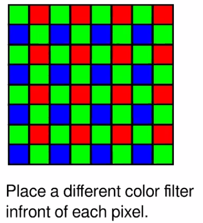
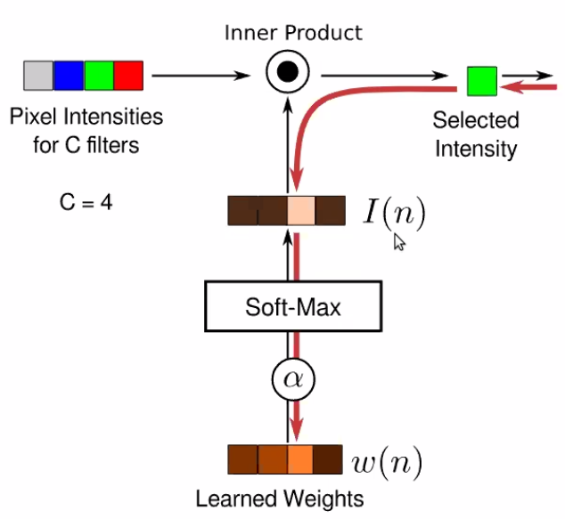

Note on Hardware Based Computational Photography
===

> Now we have far more computational power than before! 
>
> Besides, many images will go through complex algorithms as postprocessing. 
>
> But we can also optimize camera measurement, so that results look even better. 

**Fundamental tradeoff in imaging**

* Exposure Short: Light is dim, noise is high 
* Exposure Long: Camera and scene may move, may have motion blur 
* Large Aperture: Defucus blur, many points are not in focus. 
* Quantization and Dynamic range 
* Cannot have multiple measurements at the same location. 

Traditional color measure and interpolation. 

## Color interpolation problem

2014 Rethinking Color Cameras ICCP

Make sparse estimation of chromaticity and then propagate. 

> The assumption is color changes slower than luminance, SO it make sense to measure luminance more densely, then propagate color on the gray image. 

They want to learn the camera sampling design from data. 

### Automatic Design Multiplexing

Learn sensor design from data 

> Intrinsically you are treating your camera as a parametrized layer - input light output a pixel array. 

The only tricky part is to parametrize your camera design and optimize it through back-prop

You want a selection vector at each location 

You want to learn a differentiable one-hot vector at each location! 

Weights are continuous, but go through `SoftMax` as kind of 

Use $\alpha$ as a temperature controller, cooking up $\alpha$ parameter so that it encourage a hard decision finally! 

Input a 4 channel image RGBW, and do selection at *Camera Layer*. 

> Ask how modify cameras can help with your algorithm. 