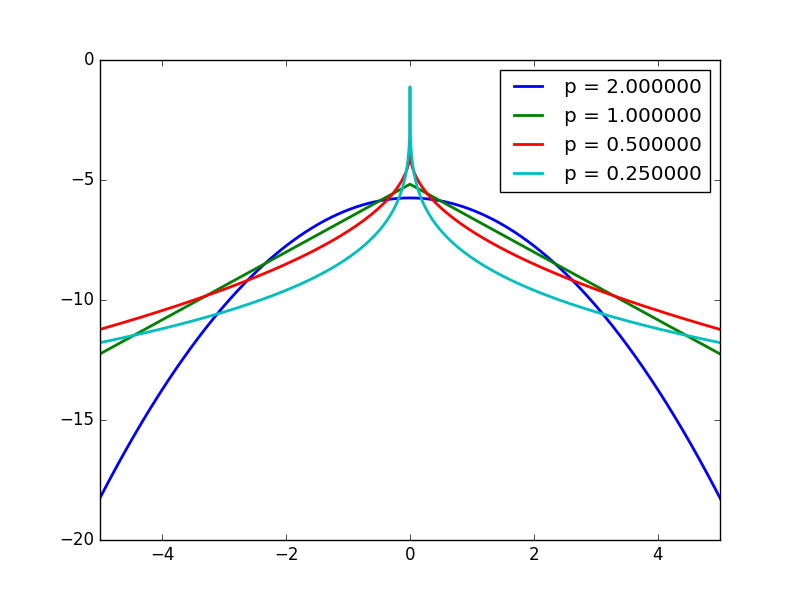
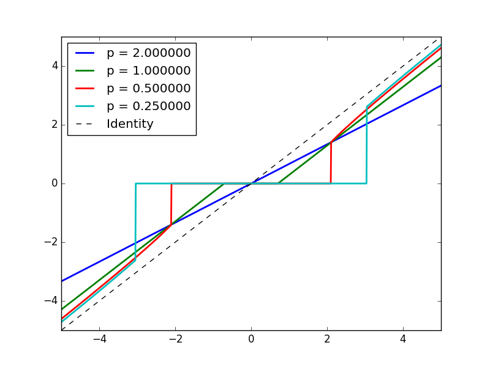
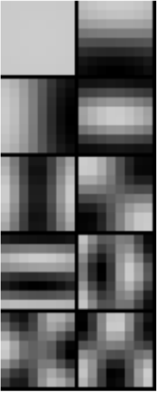
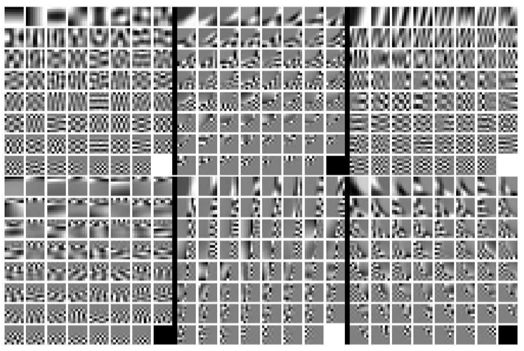
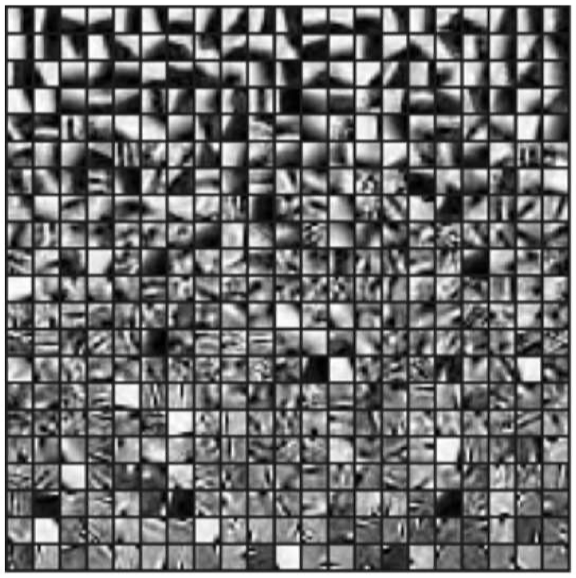

# Image Prior: Modeling Spatial Relaionship


Materials: https://www.cse.wustl.edu/~ayan/courses/cse659a/lec1.html#/

* TOC
{:toc}
This is the basis for most further applications

We need Regularizer for a spatial configuration 

$$\hat X=\arg\min_X \phi(X)+R(X)\\$$

This could be interpreted in a Bayesian way, 

$$\hat X=\arg\max_XP(X|I)P(I)=\arg\max_X\log\exp(-\phi(X))+\log\exp(-R(X))$$

# Smoothing Regularization

Images (and labels) are smooth (Gradients are small) ! 

$$R(X)=\sum_n\sum_fR(\nabla_f*X[n])$$

**Design Choices**

1. What kind of gradient to penalize
2. How do you penalize (L1, L2, Lp?) (L1 penalty is better often)

## How to analyze a prior?

- Find the distribution corresponding to that regularizer

$$p(v)\propto\exp(-R(v))$$

- See how it affect the minimizing result of a loss

$$\min_v(v-v_0)^2+R(v)$$

### Heavy Tail Distribution

- The smaller the p (p<2) the more heavy tail distribution
- Comparing to Gaussian, More emphasis in closing to 0, or quite large!
    - So it's said to be sparse prior!
- Natural image gradients appears to be heavy tail



### Shrinkage function

The operator defined by solving minimization with regularization 

$$s(v_0)=\arg\min_v\alpha(v-v_0)^2+R(v)$$

- L2: scale the identity line ! $s(v_0) = \lambda v_0$
- L1: Shrink to 0 below $\alpha$, offset other things linearly by $\alpha$
- Lp ($p<1$):  Shrink to 0 below $\alpha$, offset other things

Thus, Heavy tail regularizer will leave small values to be 0, and penalize not as hard towards the larger values. 



## Solvable Case

If you use wavelet transform (unitary matrix), then 


## Optimization

### How Lp affect optimization

- L2, it's a Least square problem,
    - Can solve in Fourier Domain, and can use conjugate gradient! (to avoid forming the matrix Q)
- L1, Convex optimization, iteratively solvable with shrinkage function
- Lp < 1, Not even convex !

## Algorithms

### Problem setting

$$\hat X=\arg\min_X\|AX-Y\|^2+\lambda\sum_n |\nabla_x*X[n]|^p + |\nabla_y*X[n]|^p$$

### Fourier Domain Least Square

If it's 


### **Conjugate Gradient**

We can do CG if $p==2$

Note, if you have per pixel weight, you have to use CG, because it's not convolution.

### Iterative Reweighted Least Square (IRLS)

**Rationale**: We know how to solve least square, so just map the problem to least square

- Use weight to transform problem as p=2
- Solve the p=2 Least square
- Update the weights
- Iterate! 

**Note**: 

- p=1 it's convex, so globally converging
- p<1 it's not guanranteed, as loss is not convex.

### Quadratic splitting

It's the simplest case of **Proximal method** in optimization. 

**Basic Idea: Split the optimization variables into 2, and** introduce relaxation variable  

- Split the problem into 2 and let the 2 parts negotiate and compete!

Relax the problem of 

$$
\arg\min_XF(X)+G(X)
$$
Into 

$$
\arg\min_X\min_WF(X)+G(W)+{\beta\over2}\|X-W\|^2
$$
When $\beta$ is large enough, this goes back to original problem

Then you can optimize the 2 variables alternatively and iteratively, if these problems are simple enough! 

$$
\hat X_t=\arg\min_X F(X)+{\beta\over2}\|X-W\|^2\\
\hat W_t=\arg\min_WG(W)+{\beta\over2}\|X-W\|^2
$$
And then you increase $\beta$ from time to time, tighten it up! make it converge back to original problem. 

Note ADMM is more principled version of this. 

In our case, relax the problem as 

$$\hat X=\arg\min_X\|AX-Y\|^2+{\beta\over2}\sum_n |\nabla_x*X[n]-w_x[n]|^2 + |\nabla_y*X[n]-w_y[n]|^2+|w_x[n]|^p+|w_y[n]|^p$$

- Thus Optimization towards $X$ can be solved by Fourier Domain Least Square.
- Optimization towards $w_x, w_y$ are pixelwise 1-d optimization. Can use shrinkage function LUT to compute.
- Also increase $\beta$

Work super well in practise 

- If your problem has multiple parts, these parts doesn't work well with each other, but they all work with quadratic loss,
- Then you can try splitting your problem!

This could be applied to deblurring! 

## Gradient Penalty Regularizer

Maybe the function should not be applied **pixel wise** to gradient, it can be applied to the gradient space as a whole. 

$$R(X)=R(\nabla*X)[n]$$

$R(.)$ can be a function on the whole space! 

- Using pixelwise regularizer is assuming independence between pixels / channels. May not be true. 
- Also the operation is independent on different pixel / elements! May not be desirable. 

### Radial function regularizer

$$
R(v_1,v_2...)=(\sqrt{v_1^2+v_2^2+...})^p=(\|v\|)^p
$$

Regularizer applies to vector norm instead of individual component. 

**n dimension Shrinkage function** 
$$
[v_1,v_2]=\arg\min_{v_1,v_2}\|v-v_0\|^2+\|v\|^p
$$
The result is interesting, It's just the original shrinkage function applied to radial direction (the vector norm direction). 

This could be applied to RGB image, the 3 channels are not independent. 

* The pixel is shrink to 0 only if all 3 channels are small to some extant!
* Shrink 3 channel independently can cause color shifting. 

# Learning Image Prior

Almost universal truth

- Better prior are more complicated, harder to optimize
- Better priors are more data driven, better than hand crafted
    - But if you have data, use data driven prior. 

$$
R(X)=-\log p(X)
$$

**Caveat**: Image itself is too high dimensional, you'd better start working with patch! 

## How to learn a distribution?

Choose a parametric form of distribution $$p(X\mid\theta) $$, which you could evaluate likelihood! 

Given the Samples $[X_1,X_2...]$, Do maximum likelihood inference for the $\theta$ 

## Gaussian Prior

Training a Gaussian prior is analytically exact! Just compute the mean and covariance matrix of all your data (image patch) samples. 
$$
\mu=\frac 1T\sum_tX_t,\; \Sigma=\frac 1T\sum_t(X_t-\mu)(X_t-\mu)^T
$$

### Gaussian Prior Characteristics

- Normally your mean vector at small scale is equal luminance !
- If you do Eigen decomposition of covariance matrix (do PCA), $\Sigma=VDV^T$ then you will find interesting result
    - PC1 pattern is the overall luminance
    - PC2-.... looks really like Fourier Basis !!!!
- Note if your samples are translational invariant, the Fourier Basis is expected!
    - Note if your images are aligned by sth., then it's no longer translational invariant, then you will see interesting patterns around the alignment point!



### Applying Prior

Actually Gaussian prior regularizer is equivalent to regularizing a filtered image. 

- Note the first PC is different!
    - Usually the first eigenvalue is pretty large !
    - And the distribution over the first eigenvector is not Gaussian! more uniform.
- The next few components will work like convolving $V_i$ onto image with a squared penalty on gradients


### Bayesian Interpretation of Gaussian Denoising


The posterior of 2 Gaussian multiplied is still a Gaussian! Good ! 

Two kinds of **Bayesian estimator**

* MAP, maximum / **mode** of the posterior $\arg\max_X p(X\mid Y)$
* Mean Estimator $\mathbb E_{p(X\mid Y)}(X)$ 

Note for Gaussian, mean and mode are the same! 


## Gaussian Mixture Prior 

$$
p(x)=\sum_i\pi_ip(x;\mu_i,\Sigma_i)\\
\sum_i \pi_i=1
$$

One step further, GMM is still a pretty good distribution. 

* Mean $\mu=\sum_i\pi_i\mu_i$ 
* Covariance: Consists of within gaussian term and across gaussian term (variance between the mean). 
  * $\mathbb E (X-\mu)(X-\mu)^T=\sum_i\pi_i\Sigma_i +\sum_i\pi_i(\mu_i-\mu)(\mu_i-\mu)^T$  

**High Flexibility**

* Multimodal
* The covariance structure is not "ellipsoidal", it can be more restrictive, choosing between axis 1,2,3 ! 
* The decay is not of gaussian speed! ---- heavier tail distribution! 
  * Choosing between close to 0, 
* etc. approximation to any function, given enough components. 

**Note**: this is also quite powerful for theoretical purpose, can use this as model of underlying distribution. 


### Fitting a Gaussian Mixture

**Parameters**: $\Theta =\{\pi_i,\mu_i,\Sigma_i\}$ 

**Bad news**: likelihood non-convex! 

* Note, there is **internal swap symmetry** of the Likelihood function, thus it's definitely non-convex

$$
\arg\max_\Theta \sum_t\log\sum_i\pi_i\det(2\pi\Sigma_i)^{-1/2}\exp(-\frac12 (X_t-\mu_i)^T\Sigma^{-1}(X_t-\mu_i)) 
$$

You have to use EM algorithm. 

### Expectation Maximization

Think of mixture of gaussian distribution as a 2 step process. 

Introduce the label variable $Z\in\{1,2,...k\}$ with distribution 

$p(Z=i)=\pi_i$

The posterior distribution of $X$ is Gaussian. 
$$
p(X\mid Z=i)=\mathcal N(X\mid \mu_i,\Sigma_i)
$$
The variable $X$ marginalizes as the GMM
$$
p(X)=\mathbb E_Z p(X\mid Z)=\sum_ip(Z=i)p(X\mid Z=i) 
$$
**Key Observation**: If you know the value of $Z_i$ for each sample (cluster belonging), then estimate the Gaussian parameters are easy. 

**EM Algorithm**: 

* Estimate $Z_i$ based on $\{\mu_i,\Sigma_i\}$ 
* Fix $Z_i$ and estimate $\{\mu_i,\Sigma_i\}$. 


**Properties**

* Similar to K Means, just with soft assignment! 
* No guanrantee of anything ..... 

**Tricks to make it work**

* One component can die! $\pi_i$ can go to 0 and it will not resurrect
  * You need to add smallest value to constraint, or reinitialize the component manually. 

* **Initialization Tricks**
  * Do random initialization
  * Try different number of K 

* **Heat up EM**
  * You can do hard K Means first and then do EM. 
* **Constrain EM**
  * You can add constraints among $\mu_i$ or $\Sigma_i$ relationship, so that you have less variable.


### Mixture Gaussian Patch Prior

Each **component allows a certain kind of variation**. It behaves like classifying the local patches first, and then regularize one kind of patch with the Gaussian estimated from PCA of training sample. 

Zoran and Weiss 2011




### GMM Regularizer

$$
\|Y-X\|^2-\log p(X)=\|Y-X\|^2-\log\sum_i\pi_if(X;\mu_i,\Sigma_i)
$$

Conceptually, note that this could be think of as posterior $p(X\mid Y)$ 

The posterior is also in GMM family! with the new parameters $\Theta'=\{\pi'_i,\mu'_i,\Sigma'_i\}$ 


So it's kind of adaptive Gaussian denoising. Given a patch in a image, 


### From Patch Prior to Image Prior

Note the priors we derived are all patch based prior. So when we denoise overlapping patches, some procedure should be taken to prevent **Oversmoothing**! 

More principle way is to crop out patches by operator $P_i$ and inference them as prior
$$
\arg\min_X\|AX-Y\|^2-\sum_i\log p(P_iX)
$$
Thus it could be inferenced by the Half Quadratic Splitting Trick! 

Weiss & Zoran 2011 EPLL 


## Sparse Dictionary Regularizer

Having a few templates, and enforce that each patch should look like the linear combination of a few templates (atoms).  Requires that the recombination weights are sparse, only a few non-zero entries. 
$$
\arg\min\|X-\sum_i\alpha_iD_i\|^2
$$


### Algorithm 

Dictionary learning 

* Direct $\alpha$ learning is combinatoric hard! There are combinatorical way of active $\alpha$ 
* Learning the templates is also hard
  * SOTA algorithm K-SVD Aharon et.al.
  * [K-SVD talk](https://www.caam.rice.edu/~optimization/L1/optseminar/K-SVD_talk_lijun.pdf)
  * [K-SVD paper](https://sites.fas.harvard.edu/~cs278/papers/ksvd.pdf)


### Dictionary Result

Note the learned dictionary looks much like the templates, more than Fourier Basis. Thus more informative. 

**Comparison to GMM**

* **GMM**: select one branch and allow a certain type of variation. 
* **Sparse Dictionary**: Store different atoms of the image. 



Refer to the advanced course. 

[CSE 585T Sparse Modeling for Imaging and Vision](https://cigroup.wustl.edu/teaching/cse585t-2018/) 

## CNN-Denoiser Based Prior

Observe that in half quadratic splitting, the prior only affects denoising, i.e. the following problem  
$$
Z=\arg\min_Z{\beta\over2}\|X-Z\|^2-\log p(Z)
$$
So no matter your application, i.e.
$$
X=\arg\min_X\|AX-Y\|_2^2+{\beta\over 2}\|X-Z\|^2-\log p(Z)
$$
you can use the denoising prior! 

### Learning Deep Denoising Prior

Given the denoising problem, It's easy to generate some image sample pairs $(X,Z)$ and use them to train a CNN to fit this function 
$$
Z=f(X;\beta)=\arg\min_Z{\beta\over2}\|X-Z\|^2-\log p(Z)
$$
So we note that we have to train a different CNN to solve the problem with a different strength of prior. 

# Markov Random Field

**Basic idea**: Use undirected graph to represent joint distribution of random variables. 

* Nodes are variables
* Edges depict direct dependency
  * No edge, means conditional independency! 

**Benefit**:

* As long as you map the problem to MRF structure, then you have a bunch of **inference algorithms available**! You don't need to think about optimization algorithm. 
* Majorly dealling with discrete variable, continuous variables can be discretized. 
* Can be combined with CNN, and formulate as RNN (unroled belief propagation. ) 

## MRF Basic 

**Markov Blanket**: the minimal set of variables $\{y_i\}$, that you need to observe, so that the other variables will be independent to the node $x$. 

* For MRF, it's the **neighbor** set of $x$. $M(x)=\mathcal N(x)$

**Clique**: Fully connected subgraph 

**Maximal Clique**: Adding any other nodes will disrupt the cliqueness.

**Property**: Joint distribution could be factorized into functions over each Clique
$$
P(V)=\frac 1Z \prod_i\Psi_i(C_i)
$$

* $\Psi_i$ are potential functions, not necessarily normalized
* $Z$ is the partition function, a *constant* depending on the potential function forms. 
  * Note $Z$ is **very expensive to compute, extremely hard**. 
  * But you don't need it for **inference** if you MAP
  * But you do need it when you are doing training! When you are learning $\Psi_i$ from data, because the $Z$ is a function over your parameter! 

$$
P(\{x_i\in V\})=\frac 1{Z(\Theta)}\prod_i\Psi_i(\{x\in C_i\};\theta_i)
$$

For example, doing MLE for a gaussian model without adding the $Z$ i.e. normalizing factor, you will get infinite covariance! The insight here is without normalizing factor, the **potential function could grow uniformly over the space**, which is undesirable. 
$$
\Psi(x)=\exp(-(x-\mu)^T\Sigma^{-1}(x-\mu))\\
Z(\mu,\Sigma)=\sqrt{(2\pi)^k\det\Sigma}\\
\arg\min_\Sigma-\log\Psi(x)=(x-\mu)^T\Sigma^{-1}(x-\mu)\mapsto \inf
$$
This hardship for normalization seems universal and fundamental. See [notes on deep unsupervised learning](Note-on-Deep-Unsupervised-Learning.md). 

## Example: Fields of Experts Image

[CVPR 2005 Roth Black](http://citeseerx.ist.psu.edu/viewdoc/download?doi=10.1.1.186.1293&rep=rep1&type=pdf)

**Single patch prior**: student t distribution prior over different filters $J_i$. 
$$
p(x)\propto\prod_i(1+\frac12(J_ix_p)^2)^{-\alpha_i}
$$
Before, when we learn the filters and regularizers for patches, we assume them as independent! However, when applying them, they become entangled, i.e. patches overlap, thus not independent. The total image prior is like, 
$$
p(X)={1\over Z(\{J_i,\alpha_i\})}\prod_p(\prod_i(1+\frac12(J_ix_p)^2)^{-\alpha_i}))
$$
Can we learn the patch parameters from whole images? 

**Training Issue**

* You cannot evaluate likelihood as you don't have $Z(\Theta)$

* Because of this, you cannot maximum likelihood estimate directly! Gradient descent / ascent is not working!! 

The authors reformulated the problem. Set $p(X)=p'(X)/Z(\Theta)$, then they can maximize the log-unnormalized likelihood. However to prevent the potential $p'$ from going up uniformly, 
$$
\mathcal L=\frac 1T\sum_1^T\log p'(X_t)-\int p(X)\log p'(X)dX
$$
Note that, if you have an unnormalized distribution, you can still draw samples from it! (MCMC). So you have $p'(X)$, you can draw samples from it, $X_p\propto p'(X)$ 
$$
\mathcal L=\frac 1T\sum_1^T\log p'(X_t)-\int p(X)\log p'(X)dX\\
\to\; \frac 1T\sum_1^T\log p'(X_t)-\frac 1P\sum_1^P \log p'(X_p)
$$
$X_p$ are drawn from the potential funcion $p'(X_p)$ .i.e. using 
$$
\frac 1P\sum_1^P \log p'(X_p)\approx\int p(X)\log p'(X)dX
$$
Sometimes, it's called **Bayesian quadrature**, i.e. using current unnormalized distribution for sampling to estimate some integral under such distribution! 

> Partition function / normalization is what make MRF hard! 

For SOTA see [Structred-SVM](https://en.wikipedia.org/wiki/Structured_support_vector_machine), CRF! 

## Pairwise MRF

A special case of MRF. 
$$
P(V)=\frac 1Z\prod_{(i,j)\in E}\psi_{i,j}(x_i,x_j)
$$

> Note any distribution could be write in pairwise fashion, using nodes representing clique, and the nodes within clique connected to it. 

Unitary term could be added. 
$$
P(V)=\frac 1Z\prod_{i\in V}\phi_{i}(x_i)\prod_{(i,j)\in E}\psi_{i,j}(x_i,x_j)
$$
Usually, we assume each variable can choose from $L$ discrete labels

## Inference problems

Normally 2 kinds of inference

* MAP problem: $\arg\max_{x_i} P(V)$ 
* Marginalize problem: $p(x_i)=\sum_{V/x_i}P(V)$, $\hat x_i=\arg\max_{x_i}p(x_i)$

[Note on Belief Propagation](Note-on-Belief-Propagation-Algorithm.md)


**Note** for different Loss function, either MAP or Max Marginal can be better! So depending on your objective, you should choose different Inference problem. 

* If the loss for different variables are independent, MM can be better
* If loss of variables are entangled, MAP can be better. 

**Note**: Energy formulation 
$$
E_i=-\log\phi_i(x_i)\\
E_{i,j}=-\log\psi_{i,j}(x_i,x_j)
$$
Then you will have a sum version energy minimization problem. 
$$
\arg\min\mathcal L(V)=\sum_iE_i(x_i)+\sum_{(i,j)\in\mathcal E} E_{i,j}(x_i,x_j)
$$

### Belief Propagation Max Marginal

Marginalization is just summation over a bunch of variables, and you can commute the summation with product. 

[Note on Belief Propagation](Note-on-Belief-Propagation-Algorithm.md) 

**Max-Product Equation** 
$$
m_{i\to j}(x_j)=\sum_{x_i}\phi(x_i)\psi(x_i,x_j)\prod_{k\in N(i)}m_{k\to i}(x_i)
$$

**Remark**

* Note this is a **recursive definition**, so if there is loops, the definition doesn't work. 
* But for **chain**, you can go from left to right and back you will get all the messages. 
* For **tree**, it's still easy, you can schedule the propagation s.t. the 
  * Pick root, propagate from all the leaves to root. 
  * Then root back to leaves.

**Tree Belief Propagation**

1. Pick a root, maintain a queue of edges. 
2. Select all the leaves, 
   1. Compute messages on the edges connected to these leaves, record these messages. 
   2. Ignore these leaves and edges, select the new leaves, iterate! 
3. Go reverse order through the list of messages. 

### Loopy Belief Propagation

1. Initialize message as all 1. 
2. Each time update a set of messages. 
3. Iterate multiple times, travel through all the edge 2 times is one epoch, do multiple epochs. 


$$
m^T_{i\to j}(x_j)=\sum_{x_i}\phi(x_i)\psi(x_i,x_j)\prod_{k\in N(i)/j}m^{T-1}_{k\to i}(x_i)\\
P(x_i)=\prod_{j\in N(i)} m^T_{j\to i}(x_i)
$$

**Remark**

* It will converge to correct answer with in a tree! 
* For Cyclic graphs it's not guaranteed.
* Renormalize message for each edge will not affect you! 

**Schedule is Important**

* When updating multiple messages, it's better each message is not directly dependent on each other. 

Probability of Pairwise MRF is a table

### Belief Propagation MAP

**Maximum and product** commute, so you can reorder the maximum equation. 

**Max-Product Equation**
$$
m_{i\to j}(x_j)=\max_{x_i}\phi_i(x_i)\psi_{i,j}(x_i,x_j)\prod_{k\in N(i)/j}m_{k\to i}(x_i)\\
x_j=\arg\max_{x_j}\phi(x_j)\prod_{i\in N(j)} m_{i\to j}(x_j)
$$


Note, **Log and Max** commute, you can compose log function to get the same result

**Max-Sum Equation**
$$
m_{i\to j}(x_j)=\max_{x_i}\log\phi_i(x_i)+\log\psi_{i,j}(x_i,x_j)+\sum_{k\in N(i)/j}m_{k\to i}(x_i)\\
x_j=\arg\max_{x_j}\log\phi(x_j)+\sum_{i\in N(j)} m_{i\to j}(x_j)
$$

* 


## Related methods

### How to handle non-binary relationship


### Belief Propagation for Factor Graph

For non-pairwise MRF, for each clique, set a Factor

Factor graph is bipartite network, one part is nodes, one part is factor

* Unary term 

### How to handle continuous distribution?

**Gaussian Belief Propagation**

* For continuous variable distribution, all summation becomes integration. 
* For GBP, record message by just record mean and cov. 
  * Assume Unary and Binary terms are Gaussian.
  * Then everything will stay Gaussian.

**Sampling Based Belief Propagation**

* Use a sample set to represent each message not distribution. 
* Not integrating out $x_i$ but sample from it's current marginal estiamte. And draw samples from $x_{i,S}$ 


## Design of Pairwise Term 

Pairwise term 
$$
E_{ij}(x_i,x_j)=\mu_{ij}V(x_i,x_j)
$$
Factorize into a edge specific weight and node value specific term. 

* Value specific form can be like $\delta(x_i,x_j)$ for labels. (Depending on Topology and Geometry of the label space.)


* The weight term can be a function of spatial distance, or feature space similarity (bilateral filter)

$$
\mu_{ij}=\exp(-\|p_i-p_j\|^2/\sigma^2)\\
\mu_{ij}=\exp(-\|p_i-p_j\|^2/\sigma^2-\|I_i-I_j\|^2/\sigma_I^2)\\
$$

* Weight function is more important for large neighborhood! Not all your neighbors are equal. (Fully connected graph esp.)
* Fully connected MRF is used! 

**Comparing Sparsely connected MRF and Fully connected MRF**: 

* Fully connected MRF express long range relationships more directly! Better result. 


## MRF: Mean Field Algorithm

> Esp. useful for Dense MRF! Much faster than BP. 

**Motivation**: Use a factorized functional form on each variable to approximate joint distribution $P(\{x_i\in V\})=\prod_iQ(x_i)$ And optimize those $Q$ separately. 

* $Q(x_i)$ is not marginal, it's more like an expected conditional, over the expected conditional of other variables. 


**Remark**: 

* This is used, similar to Belief propagation, it's a kind of message passing!
* Can approximate some NN. 


$$
Q_i'^0(x_i)=\phi_i(x_i)\\
Q_i'^{t+1}(x_i)=\phi_i(x_i)\prod_{j\in N(i)} \exp(\sum_{x_j\in L_j}Q_j^t(x_j)\log\psi_{ij}(x_i,x_j) )
$$
Note, do normalization for $Q^t_i(x)$ for each iteration. 

Understand the summation as approxiate expectation. 
$$
\sum_{x_j\in L_j}Q_j^t(x_j)\log\psi_{ij}(x_i,x_j)\approx \mathbb E_{x_j\sim Q_j^t} \log\psi_{ij}(x_i,x_j)
$$
In Log energy formulation: 
$$
\log Q'^{t+1}_i(x_i)=-E_{ii}(x_i)-\sum_{j\in N(i)}\sum_{x_j\in L_j}Q_j^t(x_j)E_{ij}(x_i,x_j)
$$
**Comparison with BP**

* The message passing around is the 


### Efficient Computation of Mean Field

Note this is super simple if the $\mu_{ij}$ is a translational invariant spatial kernel. 
$$
\log Q'^{t+1}_i(x_i)=-E_{ii}(x_i)-\sum_{j\in N(i)}\sum_{l\in L_j}Q_j^t(l)V(x_i,l)\mu_{ij}
$$
Note that the last part $\sum_{j\in N(i)}\sum_{l\in L_j}Q_j^t(l)V(x_i,l)\mu_{ij}$ it can be computed by a channel wise matmul with $V$ and a convolution with $\mu$. (Both are linear and commutes. )

Super efficient, just a convolution +  Channel wise matrix mul + normalization. Message update is simultaneous. 
$$
Q^{t+1}[n]=\exp(-U[n]-(Q^t*k)[n]\times V^T)
$$
Bilateral filtering based $\mu_{ij}$ can also be efficient using some advanced data structure. 


Krahenbuhl Koltun 2011 Efficient CRF inference 

Note, this is the MRF used in Deep Lab segmentation algorithm. (Feed CNN result into MRF). 


### CNN + MRF

Train a CNN to output `U[H,W,C]` per class probability at each pixel. This tensor can be used as an input to MRF

**Algorithm**

```python
U = CNN(I)
Q = U / U.sum(axis=2) # Normalize over labels
for i in range(T):
  # 
  Q = Depthwise_Conv(Q, k)
  Q = Conv(Q, mu)
  # 
```


**Training**

* Separate Training (DeepLab type)
  * Train CNN to output the `U[H,W,C]` with  cross entropy loss with True labels. `CrossEntropy(U,L)` And then use MRF to fine-tune this result. 
  * Note the MRF part has parameters $\mu,k$ i.e. the label distance matrix and spatial kernel. You have to hand crafted (manual optimize the MRF parameters. )
  * *Doesn't give MRF enough work to do, CNN worked too heavy*

* End to end training (CNN-RNN type) 
  * Regard the MRF part as an RNN, which can unroll into a T-layer **shared-weight CNN**. 
  * Thus you can backpropagation through pipeline! 
    * **Benefit**: Joint learning, co-design, Auto-optimize, can do more in inference than training
* **Remark on weight sharing**: 
  * Training needs backprop, need to store intermediate tensor! So unroll can be memory taxing! You cannot train large $T$ ($T\sim5$)
  * But if it's an RNN (sharing weights), you can do more iterations during inference! Using small $T$ in training, large $T$ when deployment 
  * You cannot do this if different layer has different weights. 

**ICCV 2015 Conditional Random Field as RNN**


**Remark: Why MRF do better than some CNN**

* CNN expressive power needs learning, not enough data / training cannot support a deep network. 
* For RNN or MRF, shared weights with iterative computation gives you more than just single pass mapping!  


> A general idea is that you can take a traditional CV algorithm, map the computation to sth. like RNN, and autograd to learn the parameters automatically! Differentiable computing 


## MRF: Graph Cuts Algorithm

Map the loss of MRF into a Weighted Graph Cut problem, and solve it with standard Min-Cut algorithms! 

For [graph cut problem](https://en.wikipedia.org/wiki/Cut_(graph_theory)), we are partitioning the nodes into 2 groups, and the edge across the 2 groups adds to your loss. In MRF language, each edge essentially has a 2 by 2 symmetric matrix (0 on diagonal), denoting the cost of 2 side with different labels. 


### Binary Label

**Binary label case**: Embed the MRF graph into a weighted graph

* Add 2 extra nodes $\alpha,\beta$ corresponding to 2 labels
* Add 2 edge to each nodes $(i,\alpha),(i,\beta)$ 

Then you can assign a scaler loss to each edge on the new graph! 

Min-Cut can be solved in polynomial time. 


### Multi-label: alpha beta swap 

**Multi Label Case** it's NP hard. there is only some approximate solutions. 

**Goal**: Make the improvement in Graph Cut correspond to the cost improvement in the original MRF. Solve part of the problem one at a time. 

$\alpha, \beta$  swap 


$\alpha$ expansion : 

* Those already assigned to $\alpha$ cannot be assigned to others 
* Only flip $\bar \alpha$ to $\alpha$. 
* Assign weight to edge and edge to state. 


>  Sometimes, expand base on one label at a time, will not reach 


> For semantic segmentation, graph cut can work better than belief propagation. 


## MRF: Getting Diverse Solutions 


* Single most likely solution may not be best
* We want multiple solution 
  * Interactive Segmentation: Give multiple options, let the user to choose


### Diverse Solution Formalism

2012 ECCV " Diverse M best solution for MRF! " [Lecture](http://videolectures.net/eccv2012_batra_markov/) 

Design a difference metric, find the optimal solution for $X$ for $\Delta(X_0,X)>C$. 
$$
X_1=\arg\min_X \sum_iE_i(x_i)+\sum_{ij}E_{ij}(x_i,x_j)\\
s.t. \Delta(X,X_0)=\sum_i\delta(x_i,x_{0i})>C
$$
Assume $\Delta$ to be a pixelwise difference metric.

Traditional constraint optimization can be formulated in Langragian Multipliers, the dualized form is 
$$
X_1=\arg\min_X \sum_iE_i(x_i)+\sum_{ij}E_{ij}(x_i,x_j)-\lambda \sum_i\delta(x_i,x_{0i})\\
Find\ \lambda,s.t. \sum_i\delta(x_i,x_{0i})>C
$$
This langrangian multiplier can be absorbed into $E_i(x_i)$ , i.e. encourage $x_i$ to take other value than $x_{0i}$. 

**Note**: Actually you don't really care $C$, so you can just tune the $\lambda$ Parameter for best appearance!

* Essentially you are imposing a cost for being similar to a solution before, and this cost is imposed through unitary term. 
  * Cost based on multiple pixels will be harder to translate. 


A distribution of solution may give you an interesting array of solutions, some of them may be super good! 

