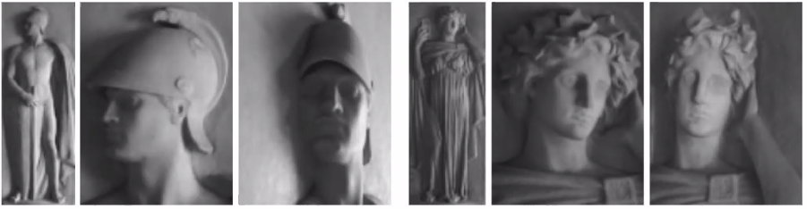
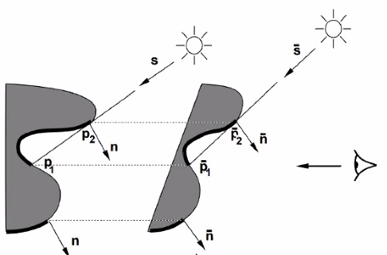
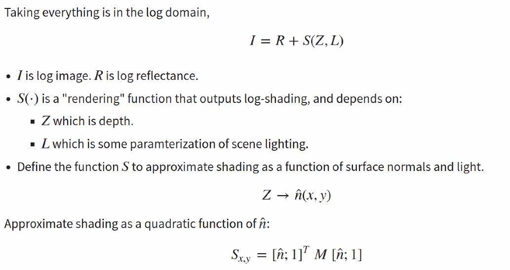

Note on Photometric Reasoning
====

Shape $\hat n$, lighting $l$, reflectance $\rho$ affect image appearance $I$. Can we infer them back? 
$$
I=\rho<\hat n,l>
$$


> How much does shading and photometric effects tell us about shape, in natural settings. 


## GBR Degeneracy

Theoretical Analysis 

* There is ambiguity from geometry. If you have $I,\rho, l$ for a pixel and want to infer $\hat n$. You know $\hat n $ up to a cone around $l$. 
* What if we know these on a patch?

Assume the shape is a graph, $z(x,y)$. Can we infer the normal / depth map from image?

IJCV 1999 The Bas-Relief Ambiguity. 



The Relief appears to be much deeper than they really are, showing that there is ambiguity ($z,z'$ ) from a single view image $I$! 

A family of shapes that have the same appearance (and shadow) when you move light accordingly. 


Assume a family of transform GBR linear transform parametrized by $\lambda,\mu,\nu$ 
$$
z'(x,y)=\lambda z(x,y)+\mu x +\nu y
$$

$$
[x,y,z']=p'=Gp,\ G=\begin{bmatrix}1& 0& 0\\
							 0& 1& 0\\
							 \mu& \nu& \lambda\end{bmatrix}
$$

$$
\hat n'=G^{-T}\hat n
$$

Assume $\rho$ is same, then it could be absorbed into $l$ thus if $l'=Gl$, then

$\hat n'\cdot l'=(G^{-T}\hat n)^T\cdot Gl= \hat n'\cdot l$ 

**Shadow**

* Attached shadow: When the $\hat n$ turns away from light $\hat n\cdot l <0$ 
* Cast shadow: When one part of shape block light to the other part. $p_1\cdot l$



Need some albedo renormalization for exact same intensity. But changing human perception don't rely on albedo that much, so you may not even need to match that! 

*Note*: the GBR transformation is designed to work for any kind of image / shape. But even with known light and albedo, is there any degeneracy? 


## Local Shape Amibiguity 

Ayan 2010

* If it's a planar surface, then the plane's amibguity is the same as a single point (cone degeneracy.)

* For curved surface, if it's a quadratic form 

$$
z(x,y)=a_1 x^2 + a_2 y^2 + a_3 xy + a_4 x + a_5 y
$$

Note, this quadratic form could always be diagonalized into $a_3==0$. 

Then your surface normal is 
$$
n_x = -\partial_x z =\\
n_y = -\partial_y z = \\
I = {l^Tn}
$$
**General Quadratic case**: 4 symmetric cases

* Flip across major curvature axis for light and curvature. 

**Cylinder Case**: $a_1=0$ or $a_2=0$ one direction is planar, the other is curved

* If you know the light direction, then you know the shape. 

**Sphere Degenerate Case**: curvature along 2 directions are the same, $a_1=a_2$. 


> However, if your lighting direction is aligned with your camera, then it's still ambiguous in 4 ways. 

Note this analysis is done within a quadratic family of surfaces. 

# Intrinsic Image Decomposition

$$
I[n] = \rho[n]f(\hat n [n],L)\\
R[n]*S[n]
$$

Kind of decomposing into reflectance times shading. 


**Usage**:

* Note, the decomposition can help recognition, and segmentation
* Useful for photo editting, only change one part of the vairable

Note, it's hypothesized human performs intrinsic image decomposition, so we could perceive Adelson's illusion, because we are perceiving the intrinsic property instead of pixel value. 

## Retinex

**Assumption**: 

* The change of reflectance and shading don't happen simultaneously! 

$$
I= R\cdot S\\
\log I = \log R + \log S\\
either \nabla \log I=\nabla \log R\; or\; \nabla \log I=\nabla \log R
$$

* Reflectance is usually piecewise constant with sharp boundary! So it has larger gradient. We can set a threshold for it. 


So the algorithm is super simple. 

```
Compute gradient for image
Classify gradient based on amplitude, copy large gradient to $R$, small gradient to $S$
```


> This method is very simple, but the **philosophy** is that naturally graident in $R$ and $S$ are different, So you can classify an observed gradient into one or the other based on the statistics of the gradient!  

## SIRPS 

> Note intrinsic image decomposition appears to be irrelavent to shape, but shading is generated from shape. So a prior on shading per se is ill posed, but prior on shape + lighting seems less ill posed. 
>
> So in later work, they decompose Shape + lighting as well, instead of pure shading. 

PAMI 2015 

>Most powerful non nn way of decompose image, SOTA for a long time. 


$$
I = R+S(Z,L)\\
Z,L = \arg\min g(I-S(Z,L))+f(Z)+h(L)\\
R= I-S(Z,L)
$$
Their light is not encoded by a 3 vector, but as some parameters of spherical harmonics, simulating multiple light source and scene light. And the image from shading could be computed from a quadratic form.


Their major contribution is 

* their design of prior. 

* Multi-scale optimization is used to solve this hard problem. 


### Prior 

**Reflectance**

* Few distince reflectance value. 
* Reflectance prior could be learnt from natural images using a GMM on 5-by-5 patches. 

Shape

* Prior on **Hessian** instead of pure $Z$ value or $n$ value. 

* Smoothness


## Single Image Reconstruction in Scene

**Note:** The result of SIRFS is good only when there is a single object in the scene. With reasonable segmentation. 

Just 2 changes 

* Use nn to segment scene image into object. 
* Learn the shape prior & Reflectance prior from this class of object specifically, instead of all images. 