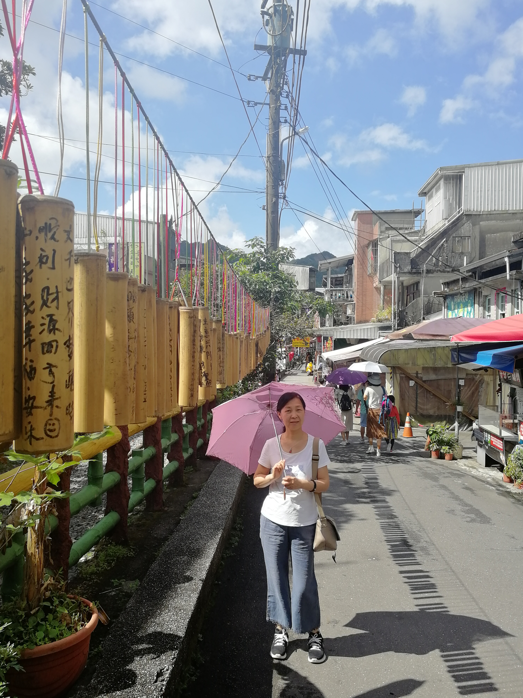
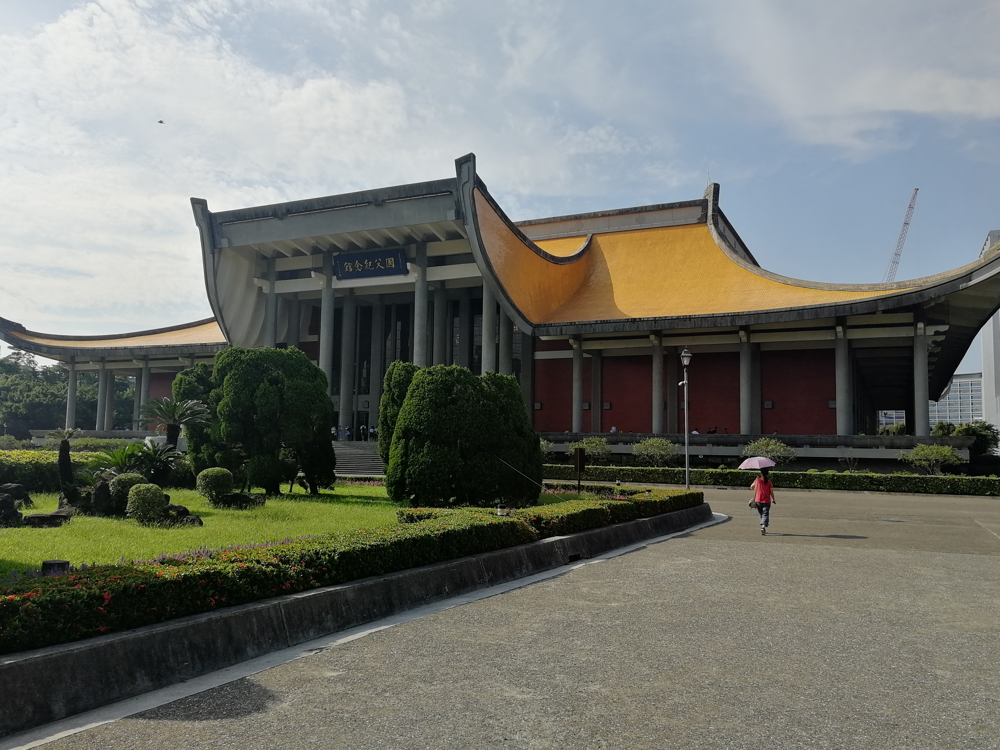
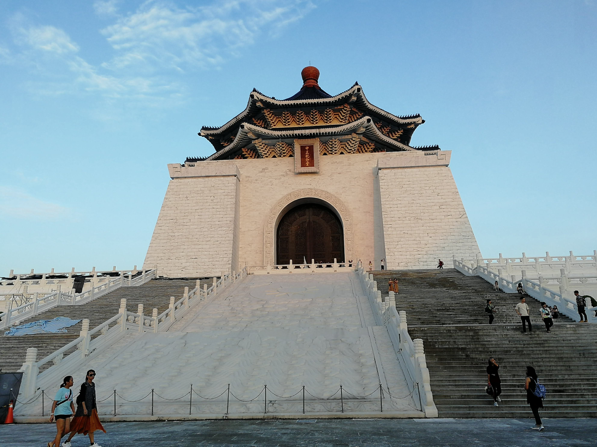
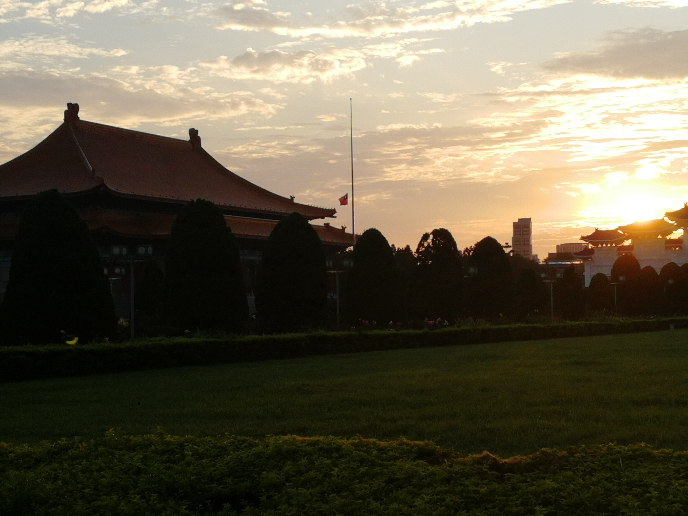
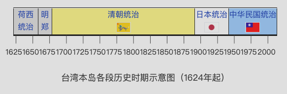

* TOC
{:toc}

## 自然/风土

### 十分老街

台北附近的 十分老街, 放天灯以及看火车的地方. 给喜欢的朋友们许愿祝福放天灯是非常开心的事情~

行人挤着看火车通过~

### 猴硐猫村

专程为了看猫猫去了台北附近的猴硐猫村, 一个充满了被人饲养的流浪猫的地方, 游客们围着几只不怕人的小猫拍照, 还不懂事的孩子们试图抱小猫超级可爱

玩儿猫猫的小孩子们

### 九份老街

## 展览

不得不说湾湾的许多展览策展都十分用心. 这次看得展览集中在台北市, which is 湾湾的文化中心. 去看了台北故宫, 总统府, 国父纪念堂(孙中山), 中正纪念堂, 士林官邸, 台大校史馆的展览. 此外在高雄的驳二艺术区也看了个微缩艺术展. 算是大都市才会有这么多文化体验了

除去台北故宫的展览主要通过文物介绍中国历史, 驳二艺术区主要展现现代艺术以及一些小文创, 其余的展览都与(过去一百年的)台湾历史, 政治紧密相关, 于是有些部分也就留到[政治](#政治)部分介绍啦

## 建筑

**国父纪念堂**, 造型仿佛经典的中式大殿屋檐 ~~被人像掀裙子一般翻起来衣角~~ 接上了一个飞扬的棚子. 

**中正纪念堂**,整个造型略微像北京的天坛,  大殿同样是中正先生的巨型铜像. 下面有中正先生的生平展

中正纪念堂正对自由广场, 两边是两个长的很像天安门的中式大殿, 有趣的是两栋建筑都是台湾的国家表演艺术中心, 类似北京的国家大剧院的角色. 古典建筑风格与现代的功能结合的很有趣. 

下图看不仔细, 真以为自己在天安门看降旗 (~~青天白日满地红旗~~) 仪式哈哈哈

## 

长得很像大宝剑/竹笋的台北101

## 政治

### 关键词: 民主, 国民党, 政治肥皂剧 

关注台湾的政治已久, 一面是大陆经常讽刺其政治如闹剧, 另一面是其政府[解严](http://www.huaxia.com/thpl/tbch/jwgc/10/5492880.html)之后施行如西方的政党政治, 并且人民参与政治程度很高, 各种游行活动层出不穷. 

跟台湾的同学们交流也可以感觉到他们的政治参与度远远强于我们大陆人. 不论是上个学年放圣诞假时一些台湾同学回到故土公投, 进行关于[性少数群体权利的投票](https://www.guancha.cn/politics/2018_11_26_481130.shtml). 

### 台大, 北大, 学生运动 

## 附录: 历史

历史是现实的根基, 地理是历史发生的舞台. 所以去一个地方通常会首先关注其历史沿革

以鄙人的记忆里还有印象的[历史事件](https://zh.wikipedia.org/zh-hans/%E8%87%BA%E7%81%A3%E6%AD%B7%E5%8F%B2)有

- 从17世纪有记载的, 荷兰及西班牙在岛上局部统治. 
- 1662 郑成功收复台湾
- 1683 清人统治台湾
- 1895 中日战争失败, 台湾从清朝割让给日本治理. 从此开始了50年的日据时期
  - 所以能感觉到对台湾文化中对日本一向是比较亲近的~ 众多日本文化中的可爱 萌萌的因素都被台湾接收了
- 1945 日本无条件投降, 国军接收台湾. 开始了国民党的统治
- 1945-49年 大量国军部队与大陆来客入住台湾. 后称外省人. 
  - 1947.2.28 二二八事件, 外省人与本土人的文化, 习惯等冲突, 引发流血事件, 不久开始了国民党的动员戡乱时期. 
- 1990-91年蒋经国选择结束动员戡乱时期, 解除党禁 报禁, 台湾开始民主化进程
  - 于是各类政党如雨后春笋般冒出来, 从民进党, 到最近柯P的台湾民众党, 层出不穷. 

也因此台湾的早期人口是以 福建,  广东人为主, 其他称为外省人, 更早的就是原住民了(大量台湾歌手有原住民血统)~  

